# Auditoria sem anestesia — site Logikos v2 (03/10/2026)

> Fase A da rodada v2.1. Dois auditores independentes, sem moderação e sem ver o trabalho um do outro, com a mesma rubrica (7 páginas × 12 dimensões, 0–10), as mesmas capturas de produção, os mesmos 15 benchmarks na mesma largura e o mesmo acesso ao código de `main` (`a7f7582`). As seções 1 e 2 são o texto deles, sem edição. As seções 3 a 8 consolidam, medem e mapeiam cada achado para a Fase B. Evidências em `docs/design/auditoria/` (ver o `README.md` de lá para reproduzir) e as seis capturas do briefing em `docs/design/evidencias/`.

## Nota geral

- **Auditor 1 — dev front-end sênior (UX + alta performance)**: 4,5/10
- **Auditor 2 — design thinking (público, 5 segundos, prova, hierarquia, marca)**: 4/10
- **Consolidada**: **4,3/10** (média simples). Meta da Fase B: ≥ 8 em todas as células, pelos mesmos dois auditores.

## O veredito da criança de 5 anos

Os dois auditores chegaram, sem se ver, à mesma frase: **não é um site de criança de cinco anos — é um wireframe de alta qualidade publicado como produto.** A gramática está certa (tokens AA nos dois temas, teclado em 100 % dos stops, axe zero, motion em `steps()` que termina em repouso, Lighthouse 98–100) e por isso ninguém o acha infantil. Mas o que aparece na tela, lado a lado com a Intenseye, a Linear ou a Vercel na mesma largura, é o nome "LOGIKOS" escrito em texto no lugar da marca com a fechadura, a glosa do nome no lugar da proposta e do slogan, retângulos escuros com chips laranja no lugar de qualquer imagem, carimbos "SIMULAÇÃO" e "PRÉVIA" em cada quadro, botões que não clicam, um formulário que responde 503, "Entrar" num hostname do Railway e chips cortados pelo selo no celular. Um comprador não compra de um site que se declara simulação seis vezes antes do primeiro clique; um integrador não assina com uma marca que não aparece. A performance de 98–100 com zero imagens não é mérito, é ausência de conteúdo — a Intenseye faz 100 com uma foto real de 66 KB na dobra. Nota consolidada **4,3/10**: profissional por dentro, comercialmente inacabado por fora e, enquanto os gates de WhatsApp, Turnstile, mídia e DNS estiverem abertos, nem funcional. Sobe para 7 com três coisas que não exigem redesenho (o SVG oficial no `Logo.astro`, H1 = ganho do comprador, um quadro real por slot com os chips dentro do estágio); chega a 8 só com prova real em cada página.

O que cada auditor escreveu, sem edição:

**Auditor 1:** Não é site de criança de cinco anos: a tipografia é consistente, o grid é disciplinado, o teclado funciona em 100 % dos stops, axe dá zero e o Lighthouse dá 98–100. É algo mais perigoso para vender: um wireframe de alta qualidade publicado como produto. Nenhuma das 24 páginas tem uma imagem; o hero mostra o nome duas vezes e uma glosa; o wordmark oficial com a fechadura não existe no site; os chips — a única "prova" — estouram e se sobrepõem no celular; e cada caminho de conversão em produção termina em 503, num fallback ou num hostname do Railway, com canonical para um domínio que não responde. Comparado lado a lado com Intenseye (100 de performance com foto real na dobra) ou Linear (produto na primeira tela a 390), a Logikos ganha em rigor técnico e perde em tudo que um comprador olha. Nota geral 4,5/10: profissional na execução, não comercial — e, enquanto os gates de WhatsApp, Turnstile, mídia e DNS estiverem abertos, nem funcional.

**Auditor 2:** Não é um site de criança de 5 anos — é um site de engenheiro sênior que ainda não tirou uma foto do produto. A gramática está certa (tokens AA nos dois temas, teclado impecável, steps() em repouso, copy de lede que fala com o gerente de planta) e por isso ele não é infantil; mas o que aparece na tela, lado a lado com Intenseye, Linear ou Vercel na mesma largura, é um texto 'LOGIKOS' no lugar da marca, a glosa do nome no lugar do slogan e da proposta, retângulos pretos com chips laranja no lugar de qualquer imagem, carimbos 'SIMULAÇÃO' e 'PRÉVIA' em cada quadro, botões que não clicam, formulário que responde 503 e chips cortados pelo selo no celular. Um comprador não compra de um site que se declara simulação seis vezes antes do primeiro clique, e um integrador não assina com uma marca que não aparece. Está profissional por dentro e comercialmente inacabado por fora: nota geral 4,0/10 — sobe para 7 com três coisas que não exigem redesenho (SVG oficial no Logo.astro, H1 = proposta + slogan oficial, um frame real por slot com clamp de chips).

## 1. Auditor 1 — dev front-end sênior (UX + alta performance) — seção integral, sem edição

Método: produção `logikos-site.pages.dev` capturada em 03/10/2026 (390 e 1440, claro e escuro, reduced-motion), `metrics.json`, `keyboard-prod.json`, `lighthouse-prod.json`, HTML de produção baixado hoje (`/`, `/recognition`, `/plataforma`, `/demos`), código em `src/`, `functions/api/lead.ts`, `public/_headers`, e os 15 benchmarks medidos com o mesmo Lighthouse. Cada achado traz arquivo:linha.

### Transversal (vale para todas as páginas)

**T1 · P0 · Toda via de contato da produção morre em silêncio.** O número de WhatsApp não está configurado (`src/lib/site.ts:15,29-31`; o HTML de produção tem 0 links `wa.me`), então o CTA principal "Falar no WhatsApp" vira "Falar com a equipe" → `/contato` (`Header.astro:19`, `WhatsAppButton.astro:22-27`). Em `/contato`, `/plataforma#conta` e `/integradores#parceria` o formulário renderiza com a chave de teste do Turnstile (`site.ts:25`; o `data-sitekey` em produção é `1x0000…AA`) e a API responde 503 `unavailable` sem a chave real (`functions/api/lead.ts:165-169`). O visitante preenche 8 campos, passa por um captcha falso e lê "Não foi possível enviar agora" (`pt-br.json:642`). O ESTADO admite ("produção fecha o formulário em 503 até a chave real"). Consequência: zero leads pelo site desde o deploy da v2. Correção: ou configura `PUBLIC_WHATSAPP_NUMBER`/`TURNSTILE_SECRET_KEY` agora, ou esconde o formulário e mostra e-mail + WhatsApp até lá; e faz o build falhar quando `TURNSTILE_SITE_KEY` é a de teste em host não-local.

**T2 · P0 · O domínio canônico está morto e a produção é noindex.** Todas as páginas apontam `canonical`, `og:url` e sitemap para `https://logikosvision.com.br` (`Base.astro:22-23`, `astro.config.ts:16`); o domínio resolve (Cloudflare) mas não responde (curl: 000). `pages.dev` leva `X-Robots-Tag: noindex` (`public/_headers`), daí o SEO 66 do Lighthouse de produção. Consequência: quem busca "Logikos visão computacional" não encontra nada; quem compartilha o link gera um card OG apontando para um site que não abre. Correção: cutover (#10) ou, no mínimo, canonical para o host que responde.

**T3 · P0 · Wordmark oficial não usado.** `Logo.astro:25-28` renderiza `LOGIKOS` em Space Grotesk 700 com tracking .16em; `Header.astro:25` e `BrandBox.astro:23` usam isso; `Footer.astro:32` usa o monograma a 32 px (o README oficial limita monograma a ≤ 24 px). O vetor com a fechadura no O e o L a 68,3° existe em `Marca/oficial/logikos-wordmark.svg` e não aparece em nenhuma das 24 páginas (evidência 04). Consequência: a marca que o cliente vê no site não é a que vê na proposta nem no painel; a fechadura (o único elemento memorável) nunca é visto. Correção: SVG inline com `fill="currentColor"` no header (≥ 90 px) e no BrandBox; símbolo isolado como favicon/OG; monograma só no spinner.

**T4 · P0 · Nenhuma mídia em 24 páginas.** 0 `` e 0 `<video>` (metrics). `src/data/media.ts:14-23`: nenhum slot tem `video`; `poster.ts:78-106` gera um retângulo #14141C com grade e caixas vazias. A Intenseye entrega Lighthouse 100 e LCP 1,5 s com uma foto WebP de 66 KB da câmera como elemento LCP; o 98–100 da Logikos é ausência de conteúdo, não mérito. Consequência: a dimensão "prova" fica em 1–2 em todas as páginas; o comprador vê colchetes laranja em torno do nada, com o selo SIMULAÇÃO em cima. Correção: um quadro real por slot (WebP 1600×900 ≤ 80 KB, `` só no hero), overlay SVG por cima; vídeo depois.

**T5 · P1 · Performance: o que o navegador paga hoje e o que vai pagar com mídia.**

- Fontes: 108 KB de 210 KB na home (51 %); as três variáveis são pré-carregadas em todas as páginas (`Base.astro:63-65`), inclusive no 404 (144 KB totais, 108 de fonte). JetBrains Mono só aparece em legendas e chips.
- CSS inline de 34 KB por página (`astro.config.ts:34`, medido no HTML de produção: 34 KB em `/`, 24 KB em `/plataforma`). Certo para a primeira visita, errado para a sessão: uma visita de 6 páginas rebaixa ~170 KB de CSS que um arquivo imutável em cache resolveria com um request.
- HTML de 87–98 KB: `/recognition` carrega 6 posters SVG inline (6 `<pattern>`, 45 `<svg>`) e 741 nós; o JSON das leituras vai duas vezes — serializado em `data-readings` (`HudVideo.astro:79`) e buscado de novo por `fetch` (`HudVideo.astro:316-320`).
- INP: `draw()` faz `getBoundingClientRect()` + `replaceChildren()` por quadro (`HudVideo.astro:197-202`). Hoje são 11–13 quadros por clipe, irrelevante. Com vídeo real e `requestVideoFrameCallback` (`HudVideo.astro:288-291`) isso vira leitura de layout a 30 Hz — reflow forçado por quadro. Cachear `k` no ResizeObserver e só redesenhar quando o índice muda.
- LCP futuro: o poster hoje é `
` (`HudVideo.astro:98-103`); se a foto real entrar como `background` ou SVG inline, o LCP não a reconhece como imagem prioritária. Tem que ser ``.
- 5 cards de alerta replicados no DOM da home (`HomeView.astro:88-90`), 4 escondidos por `display:none`; cada um com `dl` de 4 linhas. 60+ nós para mostrar um.
  Correção resumida: `inlineStylesheets: 'auto'`; preload só de Space Grotesk + Inter, mono com `font-display: optional`; remover o `fetch` do clipe quando `data-readings` já o contém; cards de alerta renderizados por template no `change`.

**T6 · P1 · O H1 carrega a pergunta de margem.** `Section.astro:32-35` e `HomeView.astro:37-40` colocam `o que é? ` dentro do `<h1>`. O leitor de tela e o Lighthouse leem "o que é? A razão que enxerga." (metrics `h1`). Correção: pergunta fora do heading (`
` antes, ou `aria-describedby`).

**T7 · P1 · Alvos abaixo de 44 px.** "Reproduzir" 128×40 (`HudVideo.astro:528` `min-height: 2.5rem`), checkboxes 18×18 nos formulários (o rótulo ajuda, mas o quadrado é o que o dedo mira). O "campo de busca de câmeras 375×23" do prompt não existe: é o honeypot `website` (`LeadForm.astro:171-174`, `tabindex="-1"`, `left:-9999px`) — não é alvo de usuário. Correção: `min-height: 2.75rem` no botão; checkbox 1.25rem com `padding` no rótulo.

**T8 · P2 · Texto ilegível dentro do poster.** `poster.ts:96` desenha "PRÉVIA" a 28 unidades num viewBox de 1600 → 6,3 px CSS a 390 (estágio de 358 px). Sem JS, os chips do poster (`chipFont: 30`) saem a 6,7 px. Correção: tirar o rótulo do SVG (o selo "simulação" já diz isso) ou movê-lo para HTML.

### Home

**H1 · P0 · O hero repete o nome e usa a glosa como headline.** Ordem de leitura a 390 (home-390-light-fold): "LOGIKOS" no header → chip "soluções" → "LOGIKOS" em caixa de 64 px → H1 "A razão que enxerga." (`HomeView.astro:36-40`, `pt-br.json:137`) → lede → dois botões → estágio só a 585 px. O README da marca diz: "A razão que enxerga" é glosa, não slogan; slogan é "Onde a lógica encontra a visão."; e as duas nunca na mesma peça — o rodapé usa a glosa como tagline (`pt-br.json:64`, `Footer.astro:33`). Teste dos 5 segundos: o olho vê o nome duas vezes e uma frase poética; o que a empresa vende só aparece na lede em cinza. Correção: BrandBox fora do hero (fica no 404 e `/_marca`); H1 = "Fogo, EPI e ergonomia na câmera que a planta já tem."; assinatura oficial só no rodapé.

**H2 · P0 · Chips estouram o estágio e o selo cobre o chip (390).** `HudVideo.astro:177` calcula `chipW` pelo comprimento do texto; `:182` posiciona em `translate(x …)` sem `Math.min(x, POSTER_W - chipW*k)`; `:512-522` põe o selo absoluto no canto superior direito. Resultado medido: 3 chips fora do estágio no hero a 390, 2 a 1440; 7 no estágio fire. Evidência 02: "não conforme · ca" cortado pelo selo SIMULAÇÃO. Correção: clamp horizontal no `drawBox` e no `boxSvg` (`poster.ts:60`); selo para dentro da `figcaption`.

**H3 · P1 · Eyebrows em caixa alta tracked-out e pergunta sem resposta.** `global.css:199-207` (`text-transform: uppercase; letter-spacing: .08em`), usado em `HomeView.astro:57,65` ("PARA A SUA PLANTA", "PARA INTEGRADORES") e `404.astro:15`; o selo `hud__badge` também. A margem pergunta "o que eu ganho?" (`pt-br.json:183`) e o título responde "Por onde você entra" (`:141`) — resposta a outra pergunta. Correção: caixa de sentença, sem tracking; título "O que você ganha" (as três linhas de cada porta já são benefícios).

**H4 · P1 · As demos ao vivo estão escondidas.** `HomeView.astro:92-97`: dois links de texto no fim da seção 4 (a 390 o estágio fire está a 3.398 px; os links, abaixo). O "Ver a demo" do hero leva a `/demos`, não à demo. Particle põe "Try the live demo" como único botão sob o H1. Correção: botão secundário do hero → demo EPI direto (nova aba) com o chip de status ao lado.

**H5 · P1 · Controles falsos.** `AlertCard.astro:60-66`: três `` com borda, raio e `min-height: 2rem` — a anatomia do `.btn` — que não fazem nada; carimbo "CAM 03 · 14:32:08" de `hero.json meta`; "decisão: aguardando pessoa" (`pt-br.json:121`). O selo "simulação" está no estágio, não no card. Correção: linha de texto "Confirmar · Descartar · Corrigir" sem borda, e "exemplo" no cabeçalho do card.

**H6 · P2 · Tudo é `dl`.** A home tem 2 `DefList` + o `dl` manual de "próximo passo" + 5 `dl` nos cards de alerta (`HomeView.astro:59,67,125,88-90`). A 1440 (home-1440-dark) a página é uma coluna de pares termo/definição com fios de 1 px. Lê-se como ficha técnica. Correção: no máximo dois `dl` por página; as duas portas viram dois blocos com um quadro cada.

### Recognition

**R1 · P1 · Chips sobrepostos no estágio.** Não é poster + overlay (o poster some via `data-state`, `HudVideo.astro:555-559`); é colisão de dois chips docados na mesma borda: `hud.ts:115` empurra o chip da pessoa e `:119` o chip do item, ambos com `chipY = y - chipH - gap` (`HudVideo.astro:179`, `poster.ts:60`) quando a caixa do capacete começa no mesmo y da caixa da pessoa. Evidência 03 e demos-390-fold ("conforme · capacete" por cima de "não conforme"). Nove chips fora do estágio a 390 (metrics). Correção: um chip por pessoa (o decisivo), e chip do item docado dentro da caixa (`y + gap`) quando o topo coincide.

**R2 · P1 · Estágio vazio.** O mock desenha caixas de corpo inteiro sobre #14141C (`poster.ts:93`); a 1440 o fold termina num painel escuro com colchetes em volta de nada. Mesma raiz de T4.

**R3 · P1 · Primeiro HUD a 740 px (390) e 723 px (1440).** O hero de texto empurra o estágio para fora da dobra em ambas as larguras; a 1440 a primeira dobra é só tipografia e grade grega (recognition-1440-light-fold). Correção: estágio ao lado do H1 como na home, ou cover mais curto.

**R4 · P2 · Peso.** 741 nós, 98 KB de HTML, 6 posters inline, 45 `<svg>`. Ver T5.

### Como funciona

**C1 · P1 · Página sem prova.** Fala de NVIDIA Jetson, câmera IP, veredito — e não mostra o dispositivo, uma câmera, um rack. A Pipeline (`Pipeline.astro`) é uma tabela de quatro passos com fios (como-funciona-390-fold). Correção: uma foto do Jetson no rack e um quadro marcado; é a página onde a imagem mais paga.

**C2 · P2 · Hero igual aos demais.** `Section.astro` cover: grade grega + pergunta + H1 + lede; o único CTA da página é o "Falar com a equipe" de fallback (keyboard-prod: stops = header → mesmo CTA → rodapé).

### Demos

**D1 · P1 · A prova real existe e a página mostra o mock.** As duas demos respondem 200 e `/api/status` diz `up`; a página abre com um poster sintético com chips sobrepostos (demos-390-fold) em vez de um quadro da demo real. Correção: screenshot da demo com a marca Logikos como poster do slot `epi` e `fire`.

**D2 · P1 · Links para hostnames do Railway.** `config/links.ts:7,9`: `recognition-demo-evento-production.up.railway.app` e `fire-demo-production.up.railway.app`. O visitante sai do site da marca para um subdomínio aleatório. Correção: `demo.logikosvision.com.br` e `fogo.logikosvision.com.br` (CNAME) ou embed.

**D3 · P2 · 4 chips fora do estágio a 390** (metrics `demos-390`). Mesma correção de H2.

### Plataforma

**P1 · P0 · "Pedir acesso" leva ao 503.** Ver T1. Formulário de conta (`PlatformView.astro:34`) com Turnstile de teste; o texto promete "Você recebe o acesso por e-mail" (`pt-br.json:857`) e o servidor devolve `unavailable`.

**P2 · P0 · "Entrar" aponta para `frontend-production-bf96.up.railway.app/login`** (`config/links.ts:26`; também em `Header.astro:66` e `HomeView.astro:147`). O comprador que checa a barra de endereço vê um hostname gerado. Correção: `app.logikosvision.com.br` antes de expor o login (#19).

**P3 · P1 · Headline de briefing.** "Dois modos. A conversa define qual serve." (`pt-br.json:801`, evidência 06) descreve o processo comercial, não o que o cliente ganha. Compare Stripe: "Infraestrutura financeira para aumentar as suas receitas." Correção: "Na planta ou na nuvem. Mesmo veredito, mesma evidência." com os dois modos abaixo.

**P4 · P1 · Caminho de compra invisível.** Não há preço (decisão registrada), não há "o que acontece depois do pedido" além de uma frase; o rodapé da seção tem o login. Keyboard-prod a 390: depois do CTA do header os 13 stops seguintes são `input` — a página inteira é formulário.

### Integradores

**I1 · P0 · "Quero ser parceiro" → formulário 503.** Ver T1.

**I2 · P1 · Zero prova de canal.** "Painel na sua marca" sem uma imagem do painel com marca de parceiro; é a única promessa visual da página e não é mostrada. Correção: um screenshot do painel white-label (mesmo com marca fictícia rotulada).

**I3 · P2 · 6 checkboxes de 18×18** (keyboard-prod). Ver T7.

### 404

**N1 · P1 · Marca errada em dose dupla.** BrandBox com wordmark em texto (`404.astro:14`) + eyebrow "■ 404" em caixa alta flutuando à direita da caixa (404-390-fold) + rodapé com a glosa como tagline. Correção: símbolo oficial, "404" em mono sem eyebrow, assinatura oficial no rodapé.

**N2 · P2 · 144 KB para uma página de 154 nós**, 108 KB de fonte. Ver T5.

### Tema escuro e reduced-motion (claim 12)

Escuro: tokens coerentes (`tokens.css:38-56`), tintas dos chips com contraste ≥ 7:1, texto secundário 5,9:1. Falha: o estágio (#14141C) sobre o fundo (#0A0A0F) com borda `--lk-line` #262631 — ≈ 1,3:1; a 1440 (home-1440-dark) a moldura do quadro desaparece e o painel vira uma mancha. Correção: `--lk-line-strong` na borda do estágio em dark. Reduced-motion: `global.css:546-554` zera durações, `HudVideo.astro:349` vai direto ao repouso, `Pipeline.astro:51` não arma, `BrandBox.astro:52` não glitcha — completo. Observação de UX, não de a11y: em celular (`handheld()`, `HudVideo.astro:205,349`) o estágio nunca toca sozinho; o visitante de telefone só vê o quadro parado e um botão "Reproduzir" de 40 px. Toda a coreografia M1–M7 descrita no ESTADO existe apenas em desktop com mouse.

### Os 12 achados do prompt — veredito

1 confirmado · 2 confirmado · 3 confirmado · 4 confirmado · 5 confirmado (mecanismo correto; vale também para /demos) · 6 confirmado · 7 confirmado · 8 confirmado · 9 parcial (escondidas na home; em /demos o botão está na dobra a 1440) · 10 confirmado · 11 confirmado com nuance (inline CSS é certo na primeira visita; as fontes são o custo real) · 12 parcial (escuro coerente, borda do estágio some; reduced-motion completo).

### O que funciona (3 linhas)

Teclado e foco: 100 % dos stops com anel, Escape devolve foco, setas trocam a leitura, Enter toca. Tokens, escala tipográfica e `steps()` aplicados sem exceção; axe 0 em 24 páginas × 2 temas. O estado ao vivo das demos (`/api/status`) é a única prova verificável do site e funciona.

## 2. Auditor 2 — design thinking (público, 5 segundos, prova, hierarquia, marca) — seção integral, sem edição

Método: cada screenshot da Logikos (produção, 03/10/2026, 390 e 1440, claro e escuro, reduced-motion) foi lido ao lado do benchmark na mesma largura; cada achado aponta arquivo:linha no repositório `logikos-site-v21`. Lente de comprador: gerente de planta, SESMT, integrador de segurança eletrônica.

### Transversal (vale para todas as páginas)

**A1 · P0 · O wordmark oficial não está no site.** `src/components/Logo.astro:25-28` renderiza `LOGIKOS` em Space Grotesk 700 com tracking .16em; o próprio arquivo admite em `Logo.astro:2` que é um "Provisional logo system until the official vector wordmark lands". É usado em `Header.astro:25` (20 px) e `BrandBox.astro:23` (64 px); `Footer.astro:32` usa o monograma a 32 px, e o README da marca diz "monograma só em ≤ 24 px". O vetor oficial existe em `~/Documents/Logikos/Marca/oficial/logikos-wordmark.svg` (L no ângulo do Λ a 68,3°, O-fechadura) e `public/` tem só `favicon.svg`. Evidência: `evidencias/04-wordmark-sem-fechadura.png` mostra letras tracked-out sem fechadura e com L reto; `logikos-wordmark@2x.png` mostra o lockup real. Ao lado da Intenseye a 390 (`intenseye-390.jpg`, topo): o "i" com o tick laranja é reconhecível a 28 px; o "LOGIKOS" do site é um texto que qualquer um digitaria. Consequência: a única coisa que a marca tem de proprietário não aparece em nenhuma das 24 páginas — para um integrador que vai colocar "painel na sua marca" na proposta, a Logikos não demonstra ter marca. Correção: inline do SVG oficial (duas cores: `#0A0A0F` claro, `#F4F6F8` escuro) em `Logo.astro`; `Header` com o lockup a ≥ 90 px de largura; `Footer` com o símbolo (O-fechadura), não o monograma; o glitch M1 passa a operar sobre o SVG (slices por `clip-path`), não sobre texto.

**A2 · P0 · A glosa do nome está no lugar do slogan — em três lugares.** `src/views/HomeView.astro:37-40` põe `h.hero.title` como `<h1>`; `src/i18n/pt-br.json:137` = "A razão que enxerga."; `pt-br.json:64` `brand.tagline` = "A razão que enxerga." vai para o rodapé de todas as páginas (`Footer.astro:33`); `pt-br.json:133` repete no `<title>` da home. O README oficial: slogan é "Onde a lógica encontra a visão."; "A razão que enxerga" é glosa, "só em textos sobre a marca", "NÃO é slogan". O slogan oficial não aparece em nenhuma página. Consequência: a headline da home (`home-1440-light-fold.jpg`) é uma frase sobre o nome da empresa, não sobre o que o gerente de planta ganha — compare com Intenseye a 1440: "See the risks. Prevent the SIFs." Correção: H1 da home vira a proposta ("Fogo, EPI e ergonomia na câmera que a planta já tem."), o lede vira a frase de prova; slogan oficial entra no fechamento e no rodapé; a glosa fica em `/sobre`.

**A3 · P0 · Zero imagem, zero vídeo em 24 páginas.** `metrics.json`: `img: 0, video: 0` em todas; `src/data/media.ts:14-23` não tem nenhuma chave `video`; o "quadro" é um SVG de caixas sobre um retângulo `#0f1016` gerado em `src/lib/poster.ts:50-75`. Na tela (`home-1440-light-fold.jpg`): um retângulo preto com dois chips laranja e cantos de caixa em volta de nada, carimbado "SIMULAÇÃO" e "PRÉVIA" ao mesmo tempo. Linear a 1440 (`lin1440.jpg`) corta a dobra com uma janela do app densa (issue DRV-8852, sidebar, feed); Intenseye com uma foto real da dome com o logo gravado. Consequência para o negócio: a tese da v2 ("a prova é o quadro", PLANO-V2 §0) depende de haver quadro; sem ele, cada estágio prova que a empresa ainda não tem imagem do próprio produto. O 98 do Lighthouse é ausência de conteúdo, não mérito (Intenseye: 100 e LCP 1,5 s com poster WebP de 66 KB). Correção: antes de qualquer mídia gerada, um quadro real de câmera da feira/piloto (mesmo 1280×720 JPEG de 60–90 KB) por slot; caixa e chip rasterizados no poster como o plano já descreve; `MEDIA` com `video` preenchido só depois.

**A4 · P1 · O mesmo hero em todas as páginas.** `src/components/Section.astro:22-35` com `cover` gera, em `/recognition`, `/como-funciona`, `/demos`, `/plataforma`, `/integradores`: grid grego + pergunta na margem + display de 3 linhas + lede + (às vezes) dois botões. A 390 (`recognition-390-light-fold.jpg`, `como-funciona-390-light-fold.jpg`, `plataforma-390-light-fold.jpg`, `integradores-390-light-fold.jpg`) as quatro primeiras dobras são indistinguíveis entre si: título preto de 3 linhas, parágrafo cinza, nada de figura. Primeiro HUD a 740 px em `/recognition`, inexistente em `/como-funciona`, `/plataforma`, `/integradores`. Consequência: cada página interna parece um template de documentação; o integrador que chega por link direto em `/integradores` não vê um painel, uma marca aplicada, nada que ele vá vender. Correção: cada capa interna ganha a sua figura na dobra (recognition: o estágio; como-funciona: o pipeline com o muro; plataforma: screenshot real do painel do Recognition; integradores: painel com marca de terceiro; demos: a câmera do visitante, não o mock).

**A5 · P1 · Carimbo duplo "SIMULAÇÃO" + "PRÉVIA" em cada quadro.** `HudVideo.astro:512-522` (`.hud__badge`, caixa alta tracked .08em, absoluto no canto superior direito) mais a palavra "PRÉVIA" no canto inferior direito do poster. Na tela o visitante lê duas vezes por quadro que aquilo não é real. Consequência: cheiro de site em construção; combinado com "Demo genérica de detecção. Não é o modelo de EPI da planta." em `/demos` (`demos-1440-light.jpg`, caixa mono), a página inteira pede desculpas. Correção: um carimbo só, em caixa baixa, na célula-máquina da legenda (`ilustrativo · CAM 03`), nunca sobre o quadro; some quando a mídia real entrar.

**A6 · P1 · Mono caps tracked-out ainda é usado como rótulo decorativo.** `metrics.json.uppercaseTracked`: "simulação", "Para a sua planta", "Para integradores" na home; `src/styles/global.css:199-218` (`.eyebrow`: mono, 0.78rem, uppercase, letter-spacing); `HomeView.astro:57,65`; `404.astro:15`. Na tela (`home-1440-light.jpg`, §2): "■ PARA A SUA PLANTA" em cinza mono 12 px sobre o título — exatamente o "tell" que o BENCHMARK.md §Motion listou como lugar-comum (Intenseye, Voxel, Viam, Anduril, Linear). A regra do plano ("eyebrow só nas portas") foi cumprida à letra e falhou na intenção: as duas portas são a seção que mais precisa parecer de comprador. Correção: as portas usam o título como rótulo de público ("Para a sua planta" vira o h3 em Space Grotesk 500); mono só na legenda do quadro e no chip de contagem/status.

### Home (`/`)

**H1 · P0 · Nos primeiros 5 segundos a tela diz "LOGIKOS LOGIKOS" e não diz o que vende.** `home-1440-light-fold.jpg`: no canto superior esquerdo, "LOGIKOS" (header); 160 px abaixo, "LOGIKOS" de 64 px dentro de uma caixa de cantos ciano com um chip preto "■ soluções" em cima (`BrandBox.astro:18-24`, `HomeView.astro:36`); depois "A razão que enxerga."; só no lede, em cinza 20 px, aparece "Fogo, EPI e ergonomia pela mesma câmera, dentro da planta." A 390 (`home-390-light-fold.jpg`): a caixa de marca ocupa 230 px de altura e empurra o primeiro quadro para 585 px (`metrics.json: firstHudTop 585`). Squint test: duas palavras pretas grandes, uma caixa, um retângulo preto com laranja — nenhuma câmera, nenhuma planta, nenhuma pessoa. Intenseye a 1440: dome com logo, eyebrow "Computer vision for workplace safety", H1 com risco e consequência, botão laranja. Correção: a BrandBox sai da home (o lockup já está no header); o H1 vira a proposta (A2); o quadro sobe para a primeira dobra a 390 com um frame real (A3).

**H2 · P0 · Chips estouram o estágio e são cobertos pelo selo.** `HudVideo.astro:179-182`: `chipY` só é limitado na vertical; `translate(${x} ${chipY})` com `chipW = texto × 0,6 × 13 + 16` sem clamp a `POSTER_W`; `.hud__badge` (`:512`) absoluto no canto superior direito sem coordenação com os chips. `metrics.json`: `overflow 3` no hero a 390, `2` a 1440; estágio `fire` `overflow 7` a 390 e 1440. Na tela (`evidencias/02`, `home-390-light-fold.jpg`): "⚠ não conforme · ca" cortado pelo "SIMULAÇÃO"; "⚠ alerta · chama" sai pela borda direita. Consequência: o único "elemento memorável" do site (PLANO-V2 §0) aparece quebrado no celular — e o celular é onde o gerente de planta abre o link do WhatsApp. Correção: `chipX = clamp(x, 0, POSTER_W − chipW)`; se não couber acima, docar à direita da caixa; selo sai do quadro (A5).

**H3 · P1 · Hierarquia: dez objetos competindo na dobra.** A 1440: chip "soluções", caixa ciano, "LOGIKOS", H1 de 2 linhas, lede, botão preto, botão fantasma, quadro preto, legenda mono de 3 linhas, chip "alerta", texto da pessoa, botão "Reproduzir". Vercel a 1440 (`vercel-1440.jpg`): um H1, um triângulo, dois botões, 60 % de ar. Correção: remover BrandBox e o botão "Reproduzir" da dobra (o clipe toca ao tocar no quadro); legenda em uma linha.

**H4 · P1 · "o que eu ganho?" → "Por onde você entra".** `pt-br.json:183` pergunta; `pt-br.json:141` responde com uma pergunta de navegação. Logo abaixo, as duas portas em `dl` (`DefList.astro`) com três linhas termo/definição cada — a mesma geometria das seções 5 (`<table class="data">`, `HomeView.astro:101`) e 6 (`dl.defs.next`, `:125`). Consequência: a seção que deveria dizer o ganho lê como índice. Correção: título "Segurança visível sem trocar câmera; painel com a sua marca." e as linhas viram duas frases de ganho com verbo.

**H5 · P1 · Controles falsos no card de alerta.** `AlertCard.astro:60-65`: `Confirmar/Descartar/Corrigir` com borda, padding e `min-height 2rem` (`:133-141`) — parecem botões, não respondem a nada; carimbo "CAM 11 · 16:02:45" vem de `src/data/hud/fire.json meta`; "decisão: aguardando pessoa" (`pt-br.json:121`) é frase de log. Na tela (`home-1440-light.jpg`, §4): três botões cinza numa moldura, um texto cinza "aguardando a pessoa". Consequência: o visitante clica, nada acontece; o site parece protótipo. Correção: renderizar como `<button disabled aria-disabled>` com rótulo "exemplo" ou como texto corrido "a pessoa confirma, descarta ou corrige"; carimbos em caixa baixa.

**H6 · P1 · As demos reais — a única prova verificável — estão num link de 14 px no fim da seção 4.** `HomeView.astro:92-97`: `
` com dois `DemoStatus` e um `<a>`; evidência `05-demos-link-escondido.png`. O hero tem "Ver a demo" (`HomeView.astro:44-46`), mas leva a `/demos`, que abre com mais dois posters mock antes dos botões "Abrir a demo". Consequência: a coisa que "roda no seu navegador" e tem chip "no ar" de verdade está três cliques e dois mocks abaixo. Correção: o botão secundário do hero abre a demo de EPI diretamente (nova aba), com o chip "no ar" ao lado.

**H7 · P2 · Tema escuro: o estágio some.** `lkdark1440.jpg`: o quadro `#0f1016` sobre fundo `#0A0A0F` perde a moldura; só a linha de legenda delimita. Reduced-motion: completo (capturas já são reduced-motion e mostram veredito). Correção: `--hud-base` com 1 px de `--lk-line-strong` no escuro.

### Recognition (`/recognition`)

**R1 · P0 · Chips sobrepostos e estágio vazio.** Não é poster + overlay (verificado: o poster some com `data-state`). É colisão de dois chips docados na mesma borda: `hud.ts:115` empurra a caixa da pessoa, `:119` a do capacete; em `hero.json`/`epi.json` o bbox da cabeça começa no mesmo `y` da pessoa (0.24), então `chipY` (`HudVideo.astro:179`, `poster.ts:60`) é idêntico. Na tela (`evidencias/03`): "✓ c✓ conforme · capacete" — um chip verde sobre outro — e à direita "⚠ não conforme · capacete" sobre cantos de uma caixa de corpo inteiro vazia. Consequência: o quadro que explica "EPI por região" mostra uma regra quebrada do próprio sistema de veredito. Correção: regra de dock — chip da pessoa à esquerda acima, chip da região à direita acima ou abaixo da sub-caixa; teste unitário de interseção de chips em `hud.ts`.

**R2 · P1 · Primeira dobra a 390 sem figura; HUD a 740 px.** `recognition-390-light-fold.jpg`: título de 3 linhas + lede de 3 linhas + 2 botões; `metrics.json: firstHudTop 740`. A 1440 o estágio começa a 723 px, cortado pela dobra. A página que vende o produto abre sem o produto. Correção: capa em duas colunas como a home, estágio na dobra.

**R3 · P1 · Repetição vertical.** `recognition-1440-light.jpg`: 9 seções, dois estágios pretos idênticos, um avatar de arame, um card de alerta, dois `dl` de três linhas (`RecognitionView.astro:42-115`), pipeline repetido da home (`:91`). Página de 6319 px de altura a 1440 e 18813 px a 390 para dizer cinco leituras. Correção: cortar "Dentro da planta" (link para `/como-funciona`), fundir "O alerta, por dentro" ao estágio.

**R4 · P2 · Lista de leituras a 390 quebra em duas linhas desalinhadas.** `recognition-390-light-fold.jpg`: "Fogo e fumaça | EPI por região do corpo" numa linha, "Ergonomia | Zonas de risco | Contagem" na outra, com fios verticais de alturas diferentes. Correção: lista horizontal rolável de uma linha (o próprio plano §4 previa).

### Como funciona (`/como-funciona`)

**C1 · P1 · Zero figura em uma página chamada "como funciona".** `como-funciona-1440-light.jpg`: capa de texto, pipeline de quatro colunas de texto dentro de um retângulo rotulado "planta" (`Pipeline.astro`), três `dl`, botão. Nenhuma câmera, nenhum Jetson, nenhum painel, nenhum alerta no WhatsApp. O integrador técnico que esta página existe para servir (PLANO-V2 §3) não vê nenhum artefato. Correção: foto do Jetson no rack (hardware real existe), screenshot do evento no painel, e o frame do alerta como ele chega.

**C2 · P2 · A 390 o pipeline vira quatro blocos de texto empilhados com fios pretos de 2 px** (`como-funciona-390-light.jpg`): o "muro" que é a ideia da figura desaparece (o quarto nó fica embaixo, dentro do mesmo fluxo). Correção: no estreito, o nó 4 fora do retângulo com a seta cruzando a borda.

### Demos (`/demos`)

**D1 · P1 · A página das demos reais abre com mocks.** `demos-1440-light.jpg`: para cada demo, à esquerda o mesmo poster SVG mock do estágio (`DemosView.astro:29 HudVideo clip={k}`), com "SIMULAÇÃO"/"PRÉVIA", legenda falsa "CAM 07 · 09:14:50" e "Reproduzir"; à direita o link real com chip "no ar". O visitante não sabe se o que vê é a demo. "Demo de EPI" aparece três vezes na mesma coluna (h2, link, `dt`). Correção: o quadro de cada demo é um frame real gravado da própria demo (câmera do visitante com caixa e chip); legenda "gravado em …"; nome uma vez.

**D2 · P1 · Chips estouram a 390 (`overflow 4`)** — `demos-390-light-fold.jpg`: "☑ ☑ conforme · capacete" (ícone duplicado = colisão R1) e "⚠ não conforme · capac" cortado pela borda e pelo selo. Mesma correção de H2/R1.

**D3 · P2 · O aviso "Demo genérica de detecção. Não é o modelo de EPI da planta." em caixa mono** lê como erro de console. Correção: frase corrida no lede: "modelo aberto, genérico; o da planta é treinado por região".

### Plataforma (`/plataforma`)

**P1 · P0 · Headline de briefing e nenhuma imagem do que se vende.** `pt-br.json:801` "Dois modos. A conversa define qual serve." + lede "Na planta, como um sensor. Ou na nuvem, como um serviço." (`evidencias/06`). Um comprador lê "ainda não decidimos". Abaixo: dois `dl` de quatro linhas (`PlatformView.astro:22-30`) e um formulário. A página da "plataforma" não mostra a plataforma — nem um screenshot do painel que o `Entrar` abre. Correção: H1 "O painel do Recognition: na planta ou na nuvem." com screenshot real do painel; os dois modos como duas colunas lado a lado com o mesmo screenshot e a diferença marcada (onde ficam clipes, licença, acesso).

**P2 · P1 · "Criar conta" é um lead form que, em produção, responde 503.** ESTADO.md: Turnstile sem chave fecha `/contato`, `#parceria` e `#conta` em 503. `keyboard-prod.json`: campo "Quantas câmeras" 375×23 px (`LeadForm.astro:116 type="number"`), sete checkboxes 18×18. Botão "Pedir acesso". Consequência: o caminho de conta promete e falha. Correção: enquanto o gate não abre, o formulário vira `mailto:`/WhatsApp com os mesmos campos no corpo; input de câmeras com `min-height 2.75rem`; checkbox com área de 44 px via label.

**P3 · P2 · "Entrar" está no fim de uma página de 3600 px** e aponta para `frontend-production-bf96.up.railway.app/login` (cheiro de staging na barra de endereço). Correção: `Entrar` na capa ao lado do H1; domínio `app.` (issue #19) antes do cutover.

### Integradores (`/integradores`)

**I1 · P1 · "Painel na sua marca" sem nenhum painel com nenhuma marca.** `integradores-1440-light.jpg`: capa de texto, "Modelo de canal" em `dl` de quatro linhas, formulário. O item número um da proposta ao integrador (`pt-br.json:166-167`) é visual por definição e não tem imagem. Correção: dois screenshots do mesmo painel com duas marcas fictícias (uma clara, uma escura).

**I2 · P2 · Dois botões iguais na capa** ("Quero ser parceiro" preto, "Falar com a equipe" fantasma, ambos com o quadrado ciano) — o fantasma vai para WhatsApp e o preto para `#parceria` (formulário em 503). Correção: um botão só até o formulário funcionar.

### 404

**N1 · P1 · BrandBox com chip "soluções" e caixa ciano repetida; "■ 404" flutua ao lado da caixa.** `404.astro:14-15`: `<BrandBox>` (inline-block) seguido de `
404
` (inline-flex) → na tela (`404-390-light-fold.jpg`, `404-1440-light-fold.jpg`) o "404" fica na mesma linha, a meia altura à direita do lockup, parecendo um erro de layout. Rodapé repete a glosa. Correção: `display:block` no eyebrow; lockup oficial; "404" como código mono abaixo do título.

### Claims do prompt (resumo; detalhe em `claims`)

1 confirmado · 2 confirmado (e amplia: glosa também no rodapé e no `<title>`) · 3 confirmado · 4 confirmado · 5 confirmado com causa (colisão de chips no mesmo `y`, não poster+overlay) · 6 confirmado · 7 confirmado · 8 confirmado · 9 parcial (hero tem "Ver a demo", mas leva a mais mock) · 10 parcial (padrão confirmado; contagens não reproduzem: home tem 8 `dl` no DOM, 4 visíveis) · 11 confirmado · 12 parcial (escuro funciona; o estágio perde a moldura; reduced-motion completo).

### O que funciona (3 linhas)

Teclado e foco: 100 % dos stops com anel, Escape fecha o menu e devolve o foco, setas trocam a leitura, Enter toca — melhor que Linear (a11y 81) e Boston Dynamics (84). Tokens de cor com AA nos dois temas, ciano só em interação, nada contínuo, `steps()` terminando em repouso — a gramática de motion do manual está implementada. A copy do lede da home e das portas ("sem trocar câmera", "o vídeo contínuo não sai", "prova, não aviso") é de comprador e sobrevive à reescrita.

## 3. Rubrica: 7 páginas × 12 dimensões (0–10; abaixo de 5 em negrito)

### 3.1 Auditor 1

| Página          | 5 s   | Proposta | Prova | Hierarquia | Marca | Copy  | Uso   | 390 px | A11y | Perf | Motion | Confiança | Média   |
| --------------- | ----- | -------- | ----- | ---------- | ----- | ----- | ----- | ------ | ---- | ---- | ------ | --------- | ------- |
| `home`          | **3** | 5        | **2** | **4**      | **3** | 6     | **4** | **3**  | 8    | 7    | 7      | **2**     | 4,5     |
| `recognition`   | 5     | 6        | **2** | 5          | **4** | 6     | 5     | **3**  | 8    | 6    | 6      | **3**     | 4,9     |
| `como-funciona` | 5     | 5        | **2** | 6          | **4** | 6     | 5     | 6      | 9    | 8    | 6      | **4**     | 5,5     |
| `demos`         | 5     | 5        | **3** | 5          | **4** | 6     | 6     | **3**  | 8    | 8    | 6      | 5         | 5,3     |
| `plataforma`    | **3** | **3**    | **1** | 5          | **4** | **4** | **3** | 6      | 7    | 8    | 7      | **1**     | 4,3     |
| `integradores`  | 5     | 6        | **1** | 6          | **4** | 6     | **3** | 6      | 7    | 8    | 7      | **2**     | 5,1     |
| `404`           | 6     | **4**    | **3** | **4**      | **3** | 6     | 7     | 7      | 9    | 8    | 7      | 5         | 5,8     |
| _média_         | 4,6   | 4,9      | 2,0   | 5,0        | 3,7   | 5,7   | 4,7   | 4,9    | 8,0  | 7,6  | 6,6    | 3,1       | **5,1** |

### 3.2 Auditor 2

| Página          | 5 s   | Proposta | Prova | Hierarquia | Marca | Copy  | Uso   | 390 px | A11y | Perf | Motion | Confiança | Média   |
| --------------- | ----- | -------- | ----- | ---------- | ----- | ----- | ----- | ------ | ---- | ---- | ------ | --------- | ------- |
| `home`          | **3** | **4**    | **2** | **3**      | **2** | 5     | 5     | **3**  | 7    | 7    | 6      | **4**     | 4,2     |
| `recognition`   | **4** | 5        | **2** | **4**      | **3** | 6     | 5     | **3**  | 7    | 7    | 6      | **4**     | 4,7     |
| `como-funciona` | **4** | **4**    | **1** | 6          | **3** | 6     | 6     | 6      | 8    | 8    | 5      | 5         | 5,2     |
| `demos`         | **4** | 5        | **3** | **4**      | **3** | 5     | 6     | **4**  | 7    | 7    | 5      | 5         | 4,8     |
| `plataforma`    | **3** | **3**    | **1** | 5          | **3** | **4** | **4** | 5      | 6    | 8    | 6      | **3**     | 4,2     |
| `integradores`  | **4** | 5        | **1** | 6          | **3** | 6     | 5     | 6      | 7    | 8    | 6      | **3**     | 5,0     |
| `404`           | 5     | 5        | **3** | **4**      | **2** | 6     | 6     | 6      | 8    | 9    | 7      | 6         | 5,6     |
| _média_         | 3,9   | 4,4      | 1,9   | 4,6        | 2,7   | 5,4   | 5,3   | 4,7    | 7,1  | 7,7  | 5,9    | 4,3       | **4,8** |

### 3.3 Consolidada (média dos dois, arredondada a 0,5)

| Página          | 5 s     | Proposta | Prova   | Hierarquia | Marca   | Copy    | Uso     | 390 px  | A11y | Perf | Motion | Confiança | Média   |
| --------------- | ------- | -------- | ------- | ---------- | ------- | ------- | ------- | ------- | ---- | ---- | ------ | --------- | ------- |
| `home`          | **3,0** | **4,5**  | **2,0** | **3,5**    | **2,5** | 5,5     | **4,5** | **3,0** | 7,5  | 7,0  | 6,5    | **3,0**   | 4,4     |
| `recognition`   | **4,5** | 5,5      | **2,0** | **4,5**    | **3,5** | 6,0     | 5,0     | **3,0** | 7,5  | 6,5  | 6,0    | **3,5**   | 4,8     |
| `como-funciona` | **4,5** | **4,5**  | **1,5** | 6,0        | **3,5** | 6,0     | 5,5     | 6,0     | 8,5  | 8,0  | 5,5    | **4,5**   | 5,3     |
| `demos`         | **4,5** | 5,0      | **3,0** | **4,5**    | **3,5** | 5,5     | 6,0     | **3,5** | 7,5  | 7,5  | 5,5    | 5,0       | 5,1     |
| `plataforma`    | **3,0** | **3,0**  | **1,0** | 5,0        | **3,5** | **4,0** | **3,5** | 5,5     | 6,5  | 8,0  | 6,5    | **2,0**   | 4,3     |
| `integradores`  | **4,5** | 5,5      | **1,0** | 6,0        | **3,5** | 6,0     | **4,0** | 6,0     | 7,0  | 8,0  | 6,5    | **2,5**   | 5,0     |
| `404`           | 5,5     | **4,5**  | **3,0** | **4,0**    | **2,5** | 6,0     | 6,5     | 6,5     | 8,5  | 8,5  | 7,0    | 5,5       | 5,7     |
| _média_         | 4,2     | 4,6      | 1,9     | 4,8        | 3,2     | 5,6     | 5,0     | 4,8     | 7,6  | 7,6  | 6,2    | 3,7       | **4,9** |

As oito células mais baixas: `integradores` × Prova = 1,0; `plataforma` × Prova = 1,0; `como-funciona` × Prova = 1,5; `home` × Prova = 2,0; `plataforma` × Confiança = 2,0; `recognition` × Prova = 2,0; `404` × Marca = 2,5; `home` × Marca = 2,5.

### 3.4 O que funciona (até três por auditor)

**Auditor 1**

- Teclado e foco: anel visível em 100 % dos stops, Escape fecha o menu e devolve o foco, setas trocam a leitura, Enter toca o clipe; axe 0 em 24 páginas × 2 temas.
- Sistema de tokens, escala tipográfica e motion em steps() aplicados sem exceção; reduced-motion completo; tema escuro coerente salvo a moldura do estágio.
- O estado ao vivo das demos (/api/status → 'no ar') é a única prova verificável do site e funciona; as duas demos respondem 200.

**Auditor 2**

- Teclado e foco: anel visível em 100 % dos stops, Escape fecha o menu e devolve o foco, setas trocam a leitura, Enter toca o clipe — acima de Linear (a11y 81) e Boston Dynamics (84).
- Sistema de tokens e motion do manual implementado: AA nos dois temas, ciano só em interação, magenta só no glitch, nada contínuo, steps() terminando em repouso, reduced-motion estático e completo.
- Copy de lede e das portas é de comprador e sobrevive à reescrita: 'pela mesma câmera, dentro da planta', 'o vídeo contínuo não sai', 'prova, não aviso'.

## 4. Achados dos auditores, por severidade

Ids originais de cada auditor (prefixo `A1·` = auditor 1, `A2·` = auditor 2). A lista única e priorizada, já sem duplicatas e com o PR que fecha cada item, está na seção seguinte.

### P0

| Id    | Página                                                | Achado                                                                                                            | Evidência                                                                                                                                                                                                                                                                             | Consequência                                                                                                                                                                      | Correção                                                                                                                                                                                                               |
| ----- | ----------------------------------------------------- | ----------------------------------------------------------------------------------------------------------------- | ------------------------------------------------------------------------------------------------------------------------------------------------------------------------------------------------------------------------------------------------------------------------------------- | --------------------------------------------------------------------------------------------------------------------------------------------------------------------------------- | ---------------------------------------------------------------------------------------------------------------------------------------------------------------------------------------------------------------------- |
| A1·T1 | transversal (home, plataforma, integradores, contato) | Toda via de contato da produção termina em 503 ou em fallback                                                     | HTML de produção: 0 links wa.me; src/lib/site.ts:15,29-31; Header.astro:19; data-sitekey em produção = chave de teste (site.ts:25); functions/api/lead.ts:165-169 devolve 503 'unavailable'; pt-br.json:642 mensagem genérica de erro; ESTADO.md 'produção fecha o formulário em 503' | Zero leads pelo site desde o deploy da v2: o visitante preenche 8 campos, passa por um captcha de teste e recebe 'Não foi possível enviar agora'.                                 | Configurar PUBLIC_WHATSAPP_NUMBER e TURNSTILE_SECRET_KEY/PUBLIC_TURNSTILE_SITE_KEY; até lá, esconder os formulários e mostrar e-mail + WhatsApp; falhar o build quando a sitekey de teste for usada em host não-local. |
| A1·T2 | transversal                                           | Canonical, OG e sitemap apontam para domínio que não responde; produção é noindex                                 | Base.astro:22-23 e astro.config.ts:16 (SITE = logikosvision.com.br); curl ao domínio: 000; public/_headers: X-Robots-Tag noindex em *.pages.dev; lighthouse-prod.json SEO 66 em todas as páginas                                                                                      | O site não é encontrável e todo link compartilhado gera um card apontando para um endereço morto.                                                                                 | Fazer o cutover do DNS (issue #10) ou apontar canonical/OG para o host que responde até lá.                                                                                                                            |
| A1·T3 | transversal                                           | Wordmark oficial (fechadura no O, L a 68,3°) não é usado em nenhuma página                                        | src/components/Logo.astro:25-28 (span .lk-wordmark 'LOGIKOS'); Header.astro:25; BrandBox.astro:23; Footer.astro:32 monograma a 32 px (README oficial: ≤ 24 px); evidência 04-wordmark-sem-fechadura.png; vetor em Marca/oficial/logikos-wordmark.svg                                  | A marca que o cliente vê no site não é a marca da proposta nem do painel; o único elemento memorável da identidade nunca aparece.                                                 | SVG oficial inline com fill=currentColor no header (≥ 90 px) e no BrandBox; símbolo isolado como favicon e OG; monograma só em ≤ 24 px.                                                                                |
| A1·T4 | transversal (home, recognition, demos, como-funciona) | Zero imagem e zero vídeo em 24 páginas; posters sintéticos em todos os slots                                      | metrics.json: img 0 / video 0 em todas as páginas; src/data/media.ts:14-23 sem video; src/lib/poster.ts:78-106 gera retângulo #14141C; benchmarks.json intenseye: performance 100, LCP 1514 ms com poster WebP de 66 KB como LCP                                                      | Prova = 1–2 em todas as páginas; o comprador vê colchetes em volta do nada com o selo SIMULAÇÃO; o 98–100 de Lighthouse é ausência de conteúdo, não mérito.                       | Um quadro real por slot (WebP 1600×900 ≤ 80 KB) como , fetchpriority=high só no hero, overlay SVG por cima; vídeo depois (PR-4).                                                                     |
| A1·H1 | home                                                  | Hero repete o nome (BrandBox) e usa a glosa 'A razão que enxerga' como headline; slogan oficial ausente           | HomeView.astro:36-40; pt-br.json:137; pt-br.json:64 tagline do rodapé = glosa (Footer.astro:33); README da marca: slogan é 'Onde a lógica encontra a visão.', glosa só em texto institucional; home-390-light-fold.jpg e evidência 01                                                 | Teste dos 5 segundos falha: o olho lê LOGIKOS duas vezes e uma frase poética; o que a empresa vende só aparece na lede cinza.                                                     | BrandBox fora do hero (fica no 404 e /_marca); H1 de benefício ('Fogo, EPI e ergonomia na câmera que a planta já tem.'); assinatura oficial só no rodapé; glosa só em /sobre.                                          |
| A1·H2 | home, recognition, demos                              | Chips estouram o estágio a 390 e o selo 'simulação' cobre o primeiro chip                                         | HudVideo.astro:177 (chipW por text.length) e :182 (translate sem clamp a POSTER_W); :512-522 (.hud__badge absoluto); poster.ts:59-60 idem; metrics overflow: home 3 (390) / 2 (1440), recognition 9, demos 4, fire 7; evidência 02                                                    | No celular, o veredito — a única 'prova' do site — aparece cortado ('não conforme · ca') e tampado pelo selo.                                                                     | Clamp horizontal em drawBox e boxSvg (Math.min(x, POSTER_W - chipW*k)); selo movido para a figcaption; chip de 11 px abaixo de 480 px.                                                                                 |
| A1·P2 | plataforma, home, demos                               | 'Entrar' e as demos apontam para hostnames gerados do Railway                                                     | config/links.ts:7,9,26; Header.astro:66; HomeView.astro:147; PlatformView.astro:40; app.logikosvision.com.br não responde (curl 000)                                                                                                                                                  | Quem olha a barra de endereço vê 'frontend-production-bf96.up.railway.app' no login da plataforma.                                                                                | app./demo./fogo.logikosvision.com.br via CNAME antes de expor o login no header (issue #19).                                                                                                                           |
| A2·A1 | todas                                                 | Wordmark oficial (O-fechadura, L no ângulo do Λ) ausente; texto puro em todo o site; monograma a 32 px no rodapé  | evidencias/04-wordmark-sem-fechadura.png vs Marca/oficial/logikos-wordmark@2x.png; src/components/Logo.astro:2,25-28; Header.astro:25; BrandBox.astro:23; Footer.astro:32 (monograma 32 px, README: ≤ 24 px); public/ só tem favicon.svg                                              | A única coisa proprietária da marca não aparece em 24 páginas; para quem vai vender 'painel na sua marca', a Logikos não demonstra ter marca.                                     | Inline do SVG oficial em Logo.astro (claro #0A0A0F / escuro #F4F6F8), lockup ≥ 90 px no header, símbolo no rodapé, glitch M1 sobre o SVG.                                                                              |
| A2·A2 | home, 404, rodapé de todas                            | Glosa 'A razão que enxerga' usada como H1, title e tagline; slogan oficial inexistente                            | HomeView.astro:37-40; pt-br.json:133,137 e :64 (brand.tagline); Footer.astro:33; README da marca: 'NÃO é slogan'; home-1440-light-fold.jpg                                                                                                                                            | A headline fala do nome da empresa, não do ganho do comprador; o slogan 'Onde a lógica encontra a visão.' não está em lugar nenhum.                                               | H1 = proposta ('Fogo, EPI e ergonomia na câmera que a planta já tem.'); slogan no fechamento e rodapé; glosa só em /sobre.                                                                                             |
| A2·A3 | todas (home, recognition, demos)                      | Zero  e zero <video>; todos os quadros são SVG sobre retângulo preto carimbado SIMULAÇÃO + PRÉVIA            | metrics.json img:0 video:0 em 20 medições; src/data/media.ts:14-23 sem chave video; poster.ts:50-75; home-1440-light-fold.jpg; lin1440.jpg (Linear com app real na dobra); int1440.jpg (foto da dome)                                                                                 | A tese 'a prova é o quadro' sem quadro prova que a empresa não tem imagem do produto; o 98 de Lighthouse é ausência de conteúdo (Intenseye: 100 e LCP 1,5 s com poster de 66 KB). | Um frame real de câmera (feira/piloto, 1280×720 JPEG 60–90 KB) por slot com caixa e chip rasterizados; vídeo depois; um só carimbo 'ilustrativo' na legenda.                                                           |
| A2·H2 | home, recognition, demos                              | Chips do HUD estouram o estágio e são cobertos pelo selo no celular                                               | HudVideo.astro:179-182 (sem clamp de x a POSTER_W), :512-522 (.hud__badge absoluto); metrics.json overflow: hero 3 (390) / 2 (1440), fire 7–9, epi demos 4; evidencias/02; home-390-light-fold.jpg ('não conforme · ca' cortado)                                                      | O elemento memorável do site aparece quebrado no dispositivo em que o gerente abre o link do WhatsApp.                                                                            | chipX = clamp(x, 0, POSTER_W − chipW); dock alternativo à direita/abaixo; selo fora do quadro.                                                                                                                         |
| A2·R1 | recognition, demos                                    | Chips sobrepostos em /recognition: colisão de caixa da pessoa e caixa do capacete no mesmo y; estágio vazio atrás | hud.ts:115 e :119; hero.json/epi.json bbox pessoa y=0.24 = bbox cabeça y=0.24; HudVideo.astro:179 e poster.ts:60 mesma fórmula de chipY; evidencias/03 ('✓ c✓ conforme · capacete')                                                                                                   | O quadro que explica 'EPI por região' mostra uma regra quebrada do próprio sistema de veredito.                                                                                   | Regra de dock: chip da pessoa à esquerda, chip da região à direita ou abaixo da sub-caixa; teste de interseção de chips em hud.ts.                                                                                     |
| A2·H1 | home                                                  | Primeira dobra da home: 'LOGIKOS' duas vezes, caixa de marca de 230 px, nada que diga o que a empresa vende       | home-1440-light-fold.jpg; home-390-light-fold.jpg; metrics.json firstHudTop 585 (390); BrandBox.astro:18-24; HomeView.astro:36                                                                                                                                                        | Squint test falha: duas palavras pretas, uma caixa, um retângulo preto — nenhuma câmera, planta ou pessoa.                                                                        | BrandBox sai da home; H1 = proposta; quadro real na primeira dobra a 390.                                                                                                                                              |
| A2·P1 | plataforma                                            | /plataforma: headline de briefing e nenhuma imagem do painel vendido                                              | pt-br.json:801 'Dois modos. A conversa define qual serve.'; evidencias/06; PlatformView.astro:20-30; plataforma-1440-light.jpg (0 figuras)                                                                                                                                            | O comprador lê 'ainda não decidimos'; a página da plataforma não mostra a plataforma.                                                                                             | H1 'O painel do Recognition: na planta ou na nuvem.' + screenshot real do painel; dois modos lado a lado com diferença marcada.                                                                                        |

### P1

| Id    | Página                                                      | Achado                                                                                                            | Evidência                                                                                                                                                                                                                                                                                                                                                                                                                                                                                                                             | Consequência                                                                                                                                                    | Correção                                                                                                                                                                                                                   |
| ----- | ----------------------------------------------------------- | ----------------------------------------------------------------------------------------------------------------- | ------------------------------------------------------------------------------------------------------------------------------------------------------------------------------------------------------------------------------------------------------------------------------------------------------------------------------------------------------------------------------------------------------------------------------------------------------------------------------------------------------------------------------------- | --------------------------------------------------------------------------------------------------------------------------------------------------------------- | -------------------------------------------------------------------------------------------------------------------------------------------------------------------------------------------------------------------------- |
| A1·R1 | recognition, demos                                          | Chips sobrepostos: pessoa e item docados na mesma borda superior                                                  | hud.ts:115 (chip da pessoa) e :119 (chip do item), ambos com chipY = y - chipH - gap em HudVideo.astro:179 e poster.ts:60; evidência 03; demos-390-light-fold.jpg ('conforme · capacete' sobre 'não conforme')                                                                                                                                                                                                                                                                                                                        | O estágio de cinco leituras — a assinatura do site — mostra texto ilegível em cima de texto.                                                                    | Um chip por pessoa (o decisivo); chip do item docado dentro da caixa (y + gap) quando o topo coincide com o da pessoa.                                                                                                     |
| A1·T5 | transversal                                                 | Orçamento de performance gasto em fontes e CSS repetido; INP e LCP vão regredir com mídia real                    | metrics: fontes 108 KB de 210 KB (51 %), 404 com 144 KB dos quais 108 fonte; Base.astro:63-65 preload de 3 variáveis em todas as páginas; astro.config.ts:34 inlineStylesheets 'always' (34 KB em /, 24 KB em /plataforma, medido no HTML de produção); HudVideo.astro:79 + :316-320 (clipe serializado no DOM e buscado de novo por fetch); HudVideo.astro:197-202 draw() lê layout e refaz o SVG por quadro; :288-291 rVFC a 30 Hz com vídeo real; :98-103 poster como 
; HomeView.astro:88-90 cinco AlertCards no DOM | Sessão de 6 páginas rebaixa ~170 KB de CSS; com vídeo real, reflow forçado por quadro; a foto real não será reconhecida como LCP se entrar como SVG/background. | inlineStylesheets 'auto' + CSS imutável; preload só de Space Grotesk e Inter, mono com font-display optional; remover o fetch quando data-readings já contém o clipe; cachear k no ResizeObserver; poster real como . |
| A1·H3 | home, 404                                                   | Eyebrows em caixa alta tracked-out e pergunta 'o que eu ganho?' respondida com 'Por onde você entra'              | global.css:199-207 (uppercase, letter-spacing .08em); HomeView.astro:57,65; 404.astro:15; pt-br.json:183 vs :141; metrics uppercaseTracked: 'simulação', 'Para a sua planta', 'Para integradores'                                                                                                                                                                                                                                                                                                                                     | Tique visual de template e uma seção cujo título não responde à pergunta da margem.                                                                             | Caixa de sentença sem tracking; título 'O que você ganha' sobre as três linhas de benefício.                                                                                                                               |
| A1·H4 | home                                                        | Demos ao vivo escondidas como link de texto no fim da seção 4; 'Ver a demo' do hero leva a uma página, não à demo | HomeView.astro:92-97; metrics home-390: HUD fire a 3398 px e os links abaixo; HomeView.astro:44 href=/demos; benchmarks particle: 'Try the live demo' único botão sob o H1                                                                                                                                                                                                                                                                                                                                                            | A única prova real (demo rodando no navegador) fica a 3.400 px da dobra no celular.                                                                             | Botão secundário do hero abre a demo EPI em nova aba com o chip de status ao lado; /demos continua.                                                                                                                        |
| A1·H5 | home, recognition                                           | Controles falsos no card de alerta e carimbo/decisão fictícios sem rótulo                                         | AlertCard.astro:60-66 (spans .alert__option com borda, raio e min-height 2rem = anatomia de .btn); hero.json meta 'CAM 03 · 14:32:08'; pt-br.json:121 'decisão: aguardando pessoa'; selo 'simulação' só no estágio, não no card                                                                                                                                                                                                                                                                                                       | Parece clicável e não é; o card lê como registro real de um sistema que não existe.                                                                             | 'Confirmar · Descartar · Corrigir' como texto sem borda; 'exemplo' no cabeçalho do card.                                                                                                                                   |
| A1·P3 | plataforma, como-funciona, demos, integradores              | Headline de briefing em /plataforma e hero idêntico em todas as páginas                                           | pt-br.json:801 'Dois modos. A conversa define qual serve.'; Section.astro cover usado em todas as views; evidência 06; benchmarks stripe H1 'Infraestrutura financeira para aumentar as suas receitas.'                                                                                                                                                                                                                                                                                                                               | O comprador aprende que haverá uma conversa, não o que ganha; cinco páginas com a mesma dobra de grade + pergunta + H1.                                         | 'Na planta ou na nuvem. Mesmo veredito, mesma evidência.'; cada hero com um quadro próprio e um CTA próprio.                                                                                                               |
| A1·T6 | transversal                                                 | H1 carrega a pergunta de margem para leitores de tela e para o Lighthouse                                         | Section.astro:32-35; HomeView.astro:37-40; metrics.json h1 = 'o que é?\nA razão que enxerga.'                                                                                                                                                                                                                                                                                                                                                                                                                                         | Título da página anunciado como 'o que é? A razão que enxerga.'.                                                                                                | Pergunta fora do heading (p visually-hidden antes, ou aria-describedby).                                                                                                                                                   |
| A1·T7 | home, recognition, demos, plataforma, integradores          | Alvos abaixo de 44 px: Reproduzir 128×40 e checkboxes 18×18; 'busca de câmeras 375×23' é o honeypot               | keyboard-prod.json smallTargets; HudVideo.astro:528 min-height 2.5rem; LeadForm.astro:171-174 (field--honeypot, tabindex=-1, left:-9999px) — não é alvo de usuário                                                                                                                                                                                                                                                                                                                                                                    | O único controle do estágio no celular tem 40 px; os checkboxes dependem do rótulo.                                                                             | min-height 2.75rem no botão; checkbox 1.25rem com padding no rótulo; ignorar o honeypot nas medições.                                                                                                                      |
| A1·D1 | demos                                                       | /demos mostra o mock quando a demo real está no ar                                                                | /api/status responde {epi:'up',fire:'up'}; DemosView.astro:26 HudVideo clip=k com poster sintético; demos-390-light-fold.jpg                                                                                                                                                                                                                                                                                                                                                                                                          | A única prova verificável do site é apresentada por um desenho com chips sobrepostos.                                                                           | Screenshot da demo com marca Logikos como poster dos slots epi e fire.                                                                                                                                                     |
| A1·C1 | como-funciona, integradores                                 | Como funciona e Integradores sem nenhuma imagem do que descrevem                                                  | como-funciona-390-light-fold.jpg (Pipeline em tabela de fios); integradores: 'Painel na sua marca' sem painel; metrics img 0                                                                                                                                                                                                                                                                                                                                                                                                          | A página que fala de Jetson, rack e painel white-label não mostra Jetson, rack nem painel.                                                                      | Foto do dispositivo no rack; screenshot do painel com marca de parceiro (rotulado como exemplo).                                                                                                                           |
| A1·N1 | 404                                                         | 404 com BrandBox em texto, eyebrow '404' flutuando e glosa como tagline                                           | 404.astro:14-15; 404-390-light-fold.jpg; Footer.astro:33 + pt-br.json:64                                                                                                                                                                                                                                                                                                                                                                                                                                                              | A página de erro é a que mais expõe a marca errada: wordmark falso, caixa alta, glosa no rodapé.                                                                | Símbolo oficial, '404' em mono sem eyebrow, assinatura oficial no rodapé.                                                                                                                                                  |
| A2·A4 | recognition, como-funciona, demos, plataforma, integradores | Mesma capa em todas as páginas internas: grid grego + display de 3 linhas + lede, sem figura                      | Section.astro:22-35 (cover); recognition/como-funciona/plataforma/integradores-390-light-fold.jpg indistinguíveis; firstHudTop 740 em /recognition, null nas outras                                                                                                                                                                                                                                                                                                                                                                   | Páginas internas parecem template de documentação; quem chega por link direto não vê o produto.                                                                 | Cada capa interna com a sua figura na dobra (estágio, pipeline, screenshot do painel, painel com marca de terceiro, câmera do visitante).                                                                                  |
| A2·A5 | home, recognition, demos                                    | Carimbo duplo 'SIMULAÇÃO' e 'PRÉVIA' em cada quadro, mais 'Demo genérica…' em caixa mono                          | HudVideo.astro:512-522; poster.ts (PRÉVIA); demos-1440-light.jpg                                                                                                                                                                                                                                                                                                                                                                                                                                                                      | O site pede desculpas duas vezes por quadro; cheiro de obra.                                                                                                    | Um carimbo em caixa baixa na célula-máquina da legenda; some com a mídia real.                                                                                                                                             |
| A2·A6 | home, 404                                                   | Mono caps tracked-out como rótulo decorativo nas portas e no 404                                                  | metrics.json uppercaseTracked ['simulação','Para a sua planta','Para integradores']; global.css:199-218; HomeView.astro:57,65; 404.astro:15; BENCHMARK.md lista o eyebrow mono caps como 'tell' do setor                                                                                                                                                                                                                                                                                                                              | A seção que mais precisa parecer de comprador usa o rótulo mais genérico do setor.                                                                              | Público vira o h3 em Space Grotesk 500; mono só em dado (legenda, contagem, status).                                                                                                                                       |
| A2·H3 | home                                                        | Dez objetos competindo na dobra da home a 1440                                                                    | home-1440-light-fold.jpg (chip soluções, caixa, LOGIKOS, H1, lede, 2 botões, quadro, legenda, chip alerta, Reproduzir) vs vercel-1440.jpg (H1, marca, 2 botões)                                                                                                                                                                                                                                                                                                                                                                       | Nada é ousado porque tudo é; o olho não sabe onde pousar.                                                                                                       | Remover BrandBox e 'Reproduzir' da dobra; legenda em uma linha.                                                                                                                                                            |
| A2·H4 | home                                                        | 'o que eu ganho?' respondido com 'Por onde você entra' e três dl iguais                                           | pt-br.json:183 e :141; HomeView.astro:54-76; mesma geometria termo/definição em §2, §5 (table :101) e §6 (:125)                                                                                                                                                                                                                                                                                                                                                                                                                       | A seção do ganho lê como índice.                                                                                                                                | Título com o ganho; linhas viram frases com verbo.                                                                                                                                                                         |
| A2·H5 | home, recognition                                           | Controles falsos no card de alerta (Confirmar/Descartar/Corrigir como spans com borda)                            | AlertCard.astro:60-65 e :133-141; carimbo de src/data/hud/*.json meta; 'decisão: aguardando pessoa' pt-br.json:121; home-1440-light.jpg §4                                                                                                                                                                                                                                                                                                                                                                                            | O visitante clica e nada acontece; site parece protótipo.                                                                                                       | <button disabled> rotulado 'exemplo' ou texto corrido; carimbos em caixa baixa.                                                                                                                                            |
| A2·H6 | home, demos                                                 | Demos reais escondidas num link de texto no fim da seção 4; 'Ver a demo' do hero leva a mais mocks                | HomeView.astro:92-97; :44-46; evidencias/05; demos-1440-light.jpg                                                                                                                                                                                                                                                                                                                                                                                                                                                                     | A única prova verificável está três cliques e dois mocks abaixo.                                                                                                | Botão secundário do hero abre a demo de EPI em nova aba com chip 'no ar'.                                                                                                                                                  |
| A2·R2 | recognition                                                 | /recognition a 390: dobra só de texto; HUD a 740 px; a 1440 estágio cortado pela dobra                            | recognition-390-light-fold.jpg; recognition-1440-light-fold.jpg; metrics.json firstHudTop 740/723                                                                                                                                                                                                                                                                                                                                                                                                                                     | A página que vende o produto abre sem o produto.                                                                                                                | Capa em duas colunas com o estágio na dobra.                                                                                                                                                                               |
| A2·R3 | recognition                                                 | /recognition com 9 seções, dois estágios pretos idênticos e pipeline repetido da home (18813 px a 390)            | recognition-1440-light.jpg; RecognitionView.astro:42-115 (:91 pipeline)                                                                                                                                                                                                                                                                                                                                                                                                                                                               | Rolagem longa com repetição; o veredito perde força a cada aparição.                                                                                            | Cortar 'Dentro da planta' (link), fundir 'O alerta, por dentro' ao estágio.                                                                                                                                                |
| A2·C1 | como-funciona                                               | /como-funciona sem nenhuma figura: pipeline é quatro colunas de texto                                             | como-funciona-1440-light.jpg; Pipeline.astro; metrics huds: []                                                                                                                                                                                                                                                                                                                                                                                                                                                                        | O integrador técnico não vê Jetson, painel nem alerta.                                                                                                          | Foto do Jetson no rack, screenshot do evento no painel, frame do alerta como chega.                                                                                                                                        |
| A2·D1 | demos                                                       | /demos abre cada demo com o poster mock do estágio ao lado do link real; nome repetido 3×                         | DemosView.astro:29; demos-1440-light.jpg (SIMULAÇÃO/PRÉVIA + 'Reproduzir' à esquerda, 'no ar' à direita; 'Demo de EPI' em h2, link e dt)                                                                                                                                                                                                                                                                                                                                                                                              | O visitante não sabe se o que vê é a demo.                                                                                                                      | Frame real gravado da própria demo como quadro; nome uma vez.                                                                                                                                                              |
| A2·P2 | plataforma, integradores                                    | 'Criar conta' é lead form que responde 503 em produção; input de câmeras 375×23 px; checkboxes 18×18              | ESTADO.md (Turnstile sem chave → 503); keyboard-prod.json smallTargets; LeadForm.astro:116                                                                                                                                                                                                                                                                                                                                                                                                                                            | O caminho de conta promete e falha; alvos abaixo de 44 px.                                                                                                      | mailto:/WhatsApp até o gate abrir; min-height 2.75rem; label de 44 px.                                                                                                                                                     |
| A2·I1 | integradores                                                | /integradores promete 'Painel na sua marca' sem nenhum painel com marca                                           | integradores-1440-light.jpg; pt-br.json:166-167; metrics huds: []                                                                                                                                                                                                                                                                                                                                                                                                                                                                     | O item nº 1 da proposta ao canal é visual e não tem imagem.                                                                                                     | Dois screenshots do painel com duas marcas fictícias.                                                                                                                                                                      |
| A2·N1 | 404                                                         | 404: BrandBox repetida e '■ 404' flutuando ao lado da caixa a meia altura                                         | 404.astro:14-15 (inline-block + inline-flex na mesma linha); 404-390-light-fold.jpg; 404-1440-light-fold.jpg                                                                                                                                                                                                                                                                                                                                                                                                                          | Parece bug de layout na página de erro.                                                                                                                         | display:block no eyebrow; lockup oficial; código abaixo do título.                                                                                                                                                         |

### P2

| Id    | Página                        | Achado                                                                                           | Evidência                                                                                                                                | Consequência                                                       | Correção                                                                  |
| ----- | ----------------------------- | ------------------------------------------------------------------------------------------------ | ---------------------------------------------------------------------------------------------------------------------------------------- | ------------------------------------------------------------------ | ------------------------------------------------------------------------- |
| A1·T9 | home, recognition (dark)      | Tema escuro: a moldura do estágio desaparece (≈1,3:1)                                            | tokens.css:38-56 (--lk-bg #0a0a0f, --lk-line #262631); HudVideo.astro:414-416 (background #14141c, border --lk-line); home-1440-dark.jpg | O quadro vira uma mancha sem borda sobre o fundo.                  | Borda do estágio em --lk-line-strong no tema escuro.                      |
| A1·T8 | home, recognition, demos      | Texto do poster a 6 px a 390 ('PRÉVIA' e chips sem JS)                                           | poster.ts:96 font-size 28 em viewBox 1600 → 6,3 px CSS num estágio de 358 px; chipFont 30 → 6,7 px sem JS                                | Parece sujeira no canto; sem JS o veredito é ilegível.             | Remover o rótulo do SVG (o selo já diz 'simulação') ou render em HTML.    |
| A1·H6 | home, recognition, plataforma | Toda seção é uma lista de definição                                                              | DefList.astro em 11 views; HomeView.astro:59,67,125 + 5 dl de AlertCard; home-1440-dark.jpg                                              | O site lê como ficha técnica; nenhuma seção tem uma forma própria. | Máximo dois dl por página; portas e modos como blocos com um quadro cada. |
| A2·H7 | home, recognition, demos      | Tema escuro: o estágio perde a moldura (#0f1016 sobre #0A0A0F)                                   | lkdark1440.jpg (home-1440-dark.jpg topo); reduced-motion completo nas capturas                                                           | No escuro o quadro é um buraco preto sem borda.                    | 1 px de --lk-line-strong no --hud-base em dark.                           |
| A2·R4 | recognition                   | Lista de leituras a 390 quebra em duas linhas com fios desalinhados                              | recognition-390-light-fold.jpg                                                                                                           | O seletor do estágio parece tabela mal renderizada.                | Linha horizontal rolável (PLANO-V2 §4).                                   |
| A2·C2 | como-funciona                 | A 390 o pipeline vira quatro blocos empilhados; o 'muro' desaparece                              | como-funciona-390-light.jpg                                                                                                              | A ideia da figura (só o alerta cruza o muro) some no celular.      | Nó 4 fora do retângulo com a seta cruzando a borda.                       |
| A2·P3 | plataforma                    | 'Entrar' no fim de 3600 px e apontando para domínio railway.app                                  | plataforma-1440-dark.jpg; src/config/links.ts LOGIN_URL; ESTADO.md issue #19                                                             | Cheiro de staging na barra de endereço do cliente.                 | Entrar na capa; domínio app. antes do cutover.                            |
| A2·I2 | integradores                  | Dois botões com o mesmo quadrado ciano na capa de /integradores, um deles para formulário em 503 | integradores-1440-light-fold.jpg                                                                                                         | CTA primário leva a um formulário que não envia.                   | Um botão só até o formulário funcionar.                                   |

## 5. Lista única priorizada → Fase B

Um item por causa, não por sintoma. Entre parênteses, os ids originais dos dois auditores (A1 = dev, A2 = designer). A coluna "Fecha em" é o PR da Fase B que fecha o item; "Vitor" marca o que não depende de código.

### P0 — sem isto o site não vende

| #    | Achado                                                                                                                                                                                         | Páginas                                 | Origem                     | Fecha em                                                                                                                                                                                                     |
| ---- | ---------------------------------------------------------------------------------------------------------------------------------------------------------------------------------------------- | --------------------------------------- | -------------------------- | ------------------------------------------------------------------------------------------------------------------------------------------------------------------------------------------------------------ |
| F-01 | Wordmark oficial (O-fechadura, L a 68,3°) ausente em header, caixa de marca, 404, `/_marca`, OG e favicon; monograma a 32 px no rodapé acima do limite de 24 px                                | todas                                   | A1·T3, A2·A1               | **PR-B** — `Logo.astro` com o SVG oficial de `Marca/oficial/`, `og.ts`, `gen-icons.mjs`, teste de regressão da marca                                                                                         |
| F-02 | Herói da home: nome duas vezes na dobra (header + caixa de 64 px), glosa "A razão que enxerga" como H1 e como tagline do rodapé; slogan oficial em lugar nenhum; dez objetos competindo a 1440 | home, rodapé de todas                   | A1·H1, A2·A2, A2·H1, A2·H3 | **PR-B** (herói = ganho + prova, sem caixa de nome) + **PR-D** (slogan oficial só no rodapé; glosa sai)                                                                                                      |
| F-03 | Zero `` e zero `<video>` em 24 páginas; o estágio é um poster SVG sobre retângulo escuro                                                                                                  | todas                                   | A1·T4, A2·A3               | **PR-C** — um quadro real por slot (webp ≤ 60 KB como LCP, `` e não `set:html`), captura das demos com câmera falsa; **Vitor**: clipe gravado ou chave RunPod (#18) para o vídeo                        |
| F-04 | Chips do HUD estouram o estágio (3 no herói a 390, 7–9 no estágio de fogo) e o selo "simulação" cobre o primeiro chip                                                                          | home, recognition, demos                | A1·H2, A2·H2               | **PR-B** — clamp horizontal em `drawBox` e `boxSvg`; selo para a legenda                                                                                                                                     |
| F-05 | Chips sobrepostos: caixa da pessoa e caixa do item docadas na mesma borda superior (`y` igual), sem colisão                                                                                    | recognition, demos, home                | A1·R1, A2·R1               | **PR-B** — empilhar chips que colidem (deslocar o segundo para dentro da caixa ou para baixo)                                                                                                                |
| F-06 | Toda via de contato morre: WhatsApp sem número (0 links `wa.me` em produção), formulário com Turnstile de teste → 503 em `/contato`, `/plataforma#conta`, `/integradores#parceria`             | home, plataforma, integradores, contato | A1·T1, A2·P2, A2·I2        | **PR-D** — formulário escondido e e-mail + telefone visíveis enquanto a chave for a de teste em host público (fail-closed na UI, não só na API); **Vitor**: `PUBLIC_WHATSAPP_NUMBER` e chaves Turnstile (#5) |
| F-07 | `canonical`, `og:url` e sitemap apontam para `logikosvision.com.br`, que não responde; `pages.dev` é noindex (decisão 0017) → SEO 66 e cards OG para um site que não abre                      | todas                                   | A1·T2                      | **Vitor** — cutover do DNS (#10). Sem mudança de código: a decisão 0017 está certa enquanto o domínio final for o destino                                                                                    |
| F-08 | `/plataforma`: H1 de briefing ("Dois modos. A conversa define qual serve."), nenhuma imagem do painel vendido, "Criar conta" que responde 503                                                  | plataforma                              | A2·P1, A1·P3               | **PR-D** (H1 e copy de comprador) + **PR-C** (screenshots do painel); **Vitor**: conta demo do Recognition (issue `platform`)                                                                                |
| F-09 | "Entrar" e as demos apontam para hostnames gerados do Railway (`*.up.railway.app`)                                                                                                             | plataforma, home, demos, rodapé         | A1·P2, A2·P3               | **Vitor** — domínios `app.`/demos (#19). Código já lê de `config/links.ts`; troca é de uma linha                                                                                                             |

### P1 — o que faz o site parecer inacabado

| #    | Achado                                                                                                                                                                                                                                                                                                                                    | Páginas                                                     | Origem                     | Fecha em                                                                                                                                                               |
| ---- | ----------------------------------------------------------------------------------------------------------------------------------------------------------------------------------------------------------------------------------------------------------------------------------------------------------------------------------------- | ----------------------------------------------------------- | -------------------------- | ---------------------------------------------------------------------------------------------------------------------------------------------------------------------- |
| F-10 | A mesma capa em todas as páginas internas (grid grego + pergunta + display de 3 linhas + lede), sem figura própria                                                                                                                                                                                                                        | recognition, como-funciona, demos, plataforma, integradores | A2·A4, A1·P3               | **PR-D** — herói por página com a prova daquela página                                                                                                                 |
| F-11 | Carimbo duplo "SIMULAÇÃO" + "PRÉVIA" em cada quadro; "PRÉVIA" a 6 px a 390; chips do poster ilegíveis sem JS                                                                                                                                                                                                                              | home, recognition, demos                                    | A2·A5, A1·T8               | **PR-B** — um rótulo só, em HTML, na legenda; rótulo sai do SVG                                                                                                        |
| F-12 | Eyebrows em caixa alta tracked-out ("Para a sua planta", "Para integradores", "404"); pergunta "o que eu ganho?" respondida por "Por onde você entra"                                                                                                                                                                                     | home, 404                                                   | A1·H3, A2·A6, A2·H4        | **PR-D** — eyebrows em caixa normal ou removidos; pergunta de margem casa com a resposta ou sai                                                                        |
| F-13 | Cartão de alerta com "Confirmar / Descartar / Corrigir" como `span` com anatomia de botão; carimbo `CAM 03 · 14:32:08` e "decisão: aguardando pessoa" sem rótulo de ilustração                                                                                                                                                            | home, recognition                                           | A1·H5, A2·H5               | **PR-B** — representação rotulada ("o que a pessoa recebe"), zero controle falso                                                                                       |
| F-14 | Demos ao vivo escondidas num link de texto no fim da seção 4; "Ver a demo" do herói leva a uma página de mocks; `/demos` mostra o poster mock ao lado do link real                                                                                                                                                                        | home, demos                                                 | A1·H4, A1·D1, A2·H6, A2·D1 | **PR-C** — demos como prova primária: botão primário, estado ao vivo, captura real no lugar do mock                                                                    |
| F-15 | `/recognition`: dobra só de texto a 390 (HUD a 740 px), 9 seções, dois estágios idênticos, pipeline repetido da home (18 813 px de altura a 390)                                                                                                                                                                                          | recognition                                                 | A2·R2, A2·R3               | **PR-D** — mídia primeiro no celular, um estágio, pipeline só em `/como-funciona`                                                                                      |
| F-16 | `/como-funciona` e `/integradores` sem nenhuma figura do que descrevem (Jetson, painel, "painel na sua marca")                                                                                                                                                                                                                            | como-funciona, integradores                                 | A2·C1, A2·I1, A1·C1        | **PR-C** — foto do edge + screenshot do painel (ilustração rotulada até a conta demo)                                                                                  |
| F-17 | Orçamento de performance: fontes = 51 % do peso (108 KB em todas as páginas, inclusive 404), CSS inline de 24–34 KB repetido por página, clipe JSON serializado em `data-readings` e buscado de novo por `fetch`, `draw()` lê layout por quadro, poster como `set:html` (LCP não o reconhece), 5 cartões de alerta no DOM para mostrar um | todas                                                       | A1·T5                      | **PR-E** — subsets de fonte, mono `font-display: optional`, `inlineStylesheets: 'auto'`, um só caminho para o clipe, `k` cacheado, LCP = ``, cartões por template |
| F-18 | H1 carrega a pergunta de margem (`o que é? `): leitor de tela e Lighthouse leem "o que é? A razão que enxerga."                                                                                                                                                                                      | todas as capas                                              | A1·T6                      | **PR-D** — pergunta fora do heading                                                                                                                                    |
| F-19 | Alvos abaixo de 44 px: "Reproduzir" 128×40, checkboxes 18×18                                                                                                                                                                                                                                                                              | home, recognition, demos, plataforma, integradores          | A1·T7, A2·P2               | **PR-B** (botão do HUD) + **PR-D** (formulário)                                                                                                                        |
| F-20 | 404: caixa de marca em texto, eyebrow "404" flutuando ao lado da caixa, glosa como tagline                                                                                                                                                                                                                                                | 404                                                         | A2·N1, A1·N1               | **PR-B**                                                                                                                                                               |
| F-21 | Listas de definição como layout geral (8 `dl` no DOM da home, 4 visíveis; 3–4 por página em `/plataforma` e `/integradores`)                                                                                                                                                                                                              | home, recognition, plataforma, integradores                 | A1·H6, A2·H4               | **PR-D** — `dl` só onde a comparação é o conteúdo                                                                                                                      |

### P2 — acabamento

| #    | Achado                                                                           | Páginas                  | Origem       | Fecha em                                       |
| ---- | -------------------------------------------------------------------------------- | ------------------------ | ------------ | ---------------------------------------------- |
| F-22 | Tema escuro: a moldura do estágio desaparece (`#14141C` sobre `#0A0A0F` ≈ 1,3:1) | home, recognition, demos | A1·T9, A2·H7 | **PR-B** — borda com contraste ≥ 3:1 no escuro |
| F-23 | Lista de leituras a 390 quebra em duas linhas com fios desalinhados              | recognition, home        | A2·R4        | **PR-D** — linha rolável                       |
| F-24 | Pipeline a 390 vira quatro blocos empilhados; o "muro" some                      | como-funciona            | A2·C2        | **PR-D**                                       |
| F-25 | "Entrar" só no fim de `/plataforma` (3 600 px)                                   | plataforma               | A2·P3        | **PR-D** — "Entrar" na capa                    |

### Correção à própria medição

O "campo de câmeras 375×23 px" listado em `keyboard-prod.json` (e no briefing) é o honeypot `website` do formulário (`LeadForm.astro:171-174`, `tabindex="-1"`, fora da tela): não é um alvo de usuário. Fica fora da lista; o script de teclado passa a ignorar campos com `tabindex="-1"` na re-auditoria.

## 6. Os 15 pares, na mesma largura

Cada par é a primeira dobra de `logikos-site.pages.dev` (home, tema claro) à esquerda e a do benchmark à direita, capturadas na mesma largura (1440 e 390) e reduzidas juntas a 50 %. Os arquivos completos estão em `auditoria/benchmarks/` e `auditoria/logikos/`; os pares em `auditoria/pares/`. "O que a diferença custa" é a leitura técnica; a leitura dos auditores vem nas seções 1 e 2.

### 6.1 Anduril — referência v2

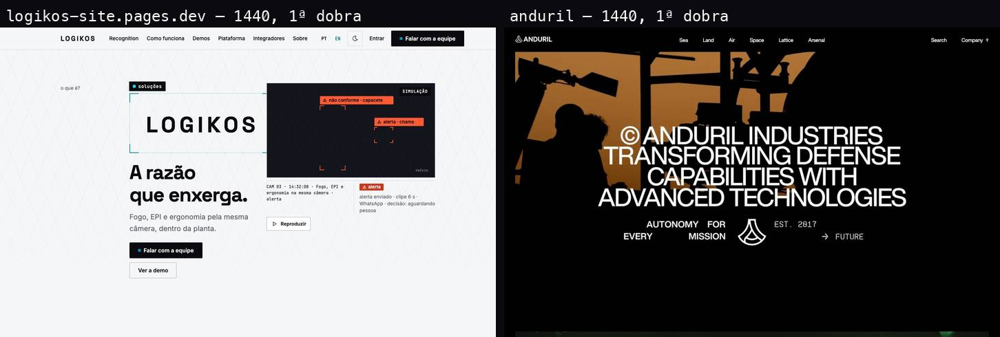

390 px

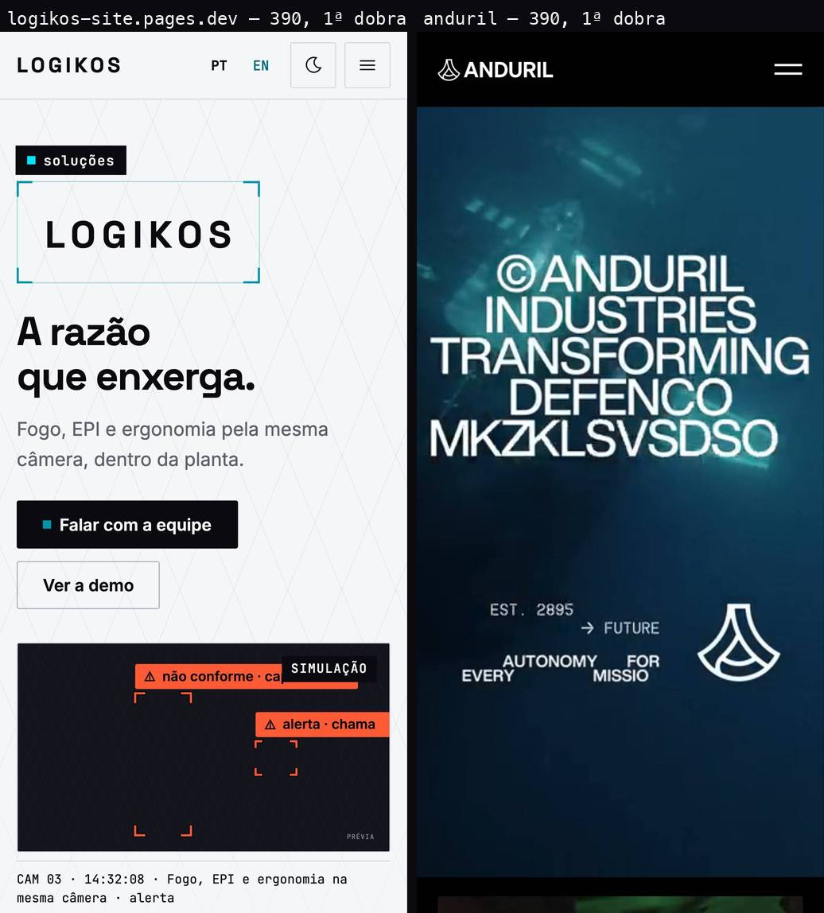

- **H1 deles:** "@[shortTitle]" (hidden placeholder; visible hero title is burned into the video: "Transforming defense capabilities with advanced technolog
- **Mídia na dobra:** Autoplay MP4 brand film from cdn.sanity.io (1376x864, 1920x1080 poster): mood/montage footage (sunset silhouette with launcher at 1440; underwater scene at 390), with the headline typeset inside the video. Not a product screenshot. A second MP4 (Thunder aircra
- **Números:** perf 60 · LCP 7.4 s · 3881 KB · 11 img, 2 video
- **O que a diferença custa:** Filme de marca com headline queimada no vídeo, 3,9 MB, perf 60. **Custa só a referência de tom**: cinema não é o nosso registro; o que vale é a hierarquia (uma frase, um vídeo, um botão).

### 6.2 Axis — referência v2

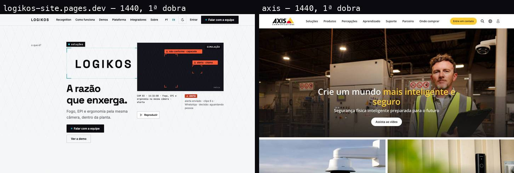

390 px

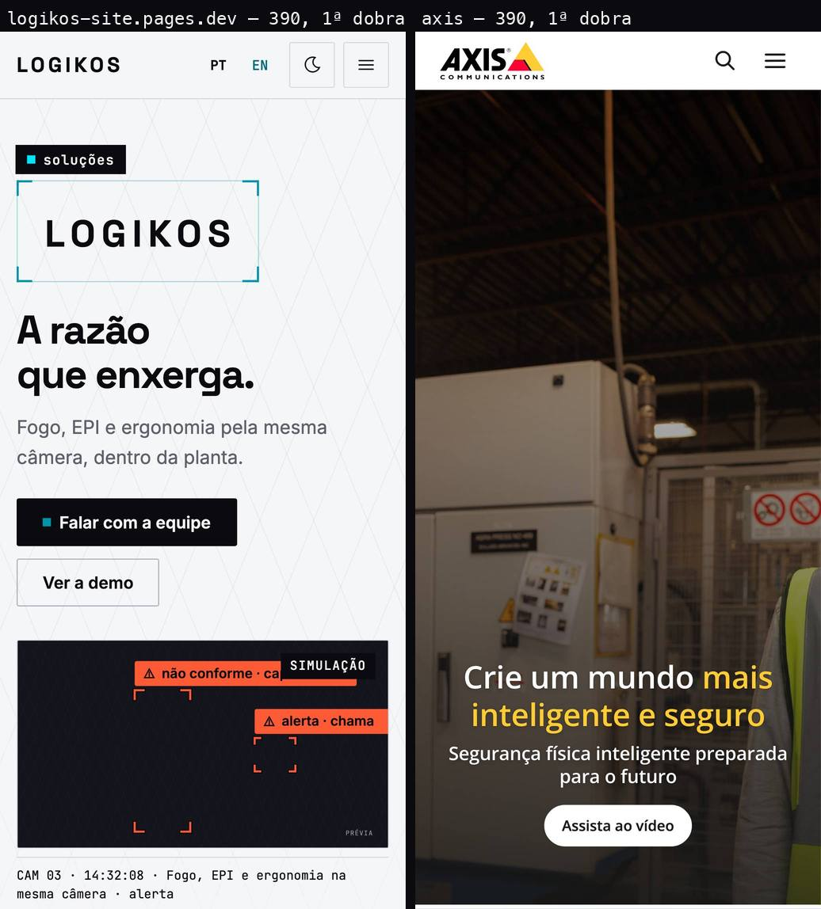

- **H1 deles:** Axis Communications – Líder em câmeras em rede e outras soluções de rede IP
- **Mídia na dobra:** One real photo: hero_ss_phase1_5120x2880px_2607.jpg.webp (responsive <picture>, alt "Create a smarter, safer world") showing a factory floor with a worker and a ceiling-mounted Axis dome camera; plus the tops of two product photos (outdoor dome camera, door in
- **Números:** perf 54 · LCP 3.2 s · 2385 KB · 90 img, 0 video
- **O que a diferença custa:** Foto real de chão de fábrica com câmera no teto, 2,4 MB, 90 imagens. **Custa a prova de ambiente**: Axis é a câmera que o nosso cliente já tem; a foto deles é o nosso cenário.

### 6.3 Boston Dynamics — referência v2

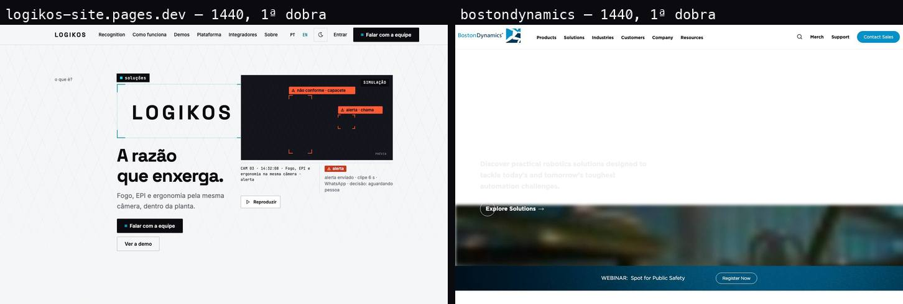

390 px

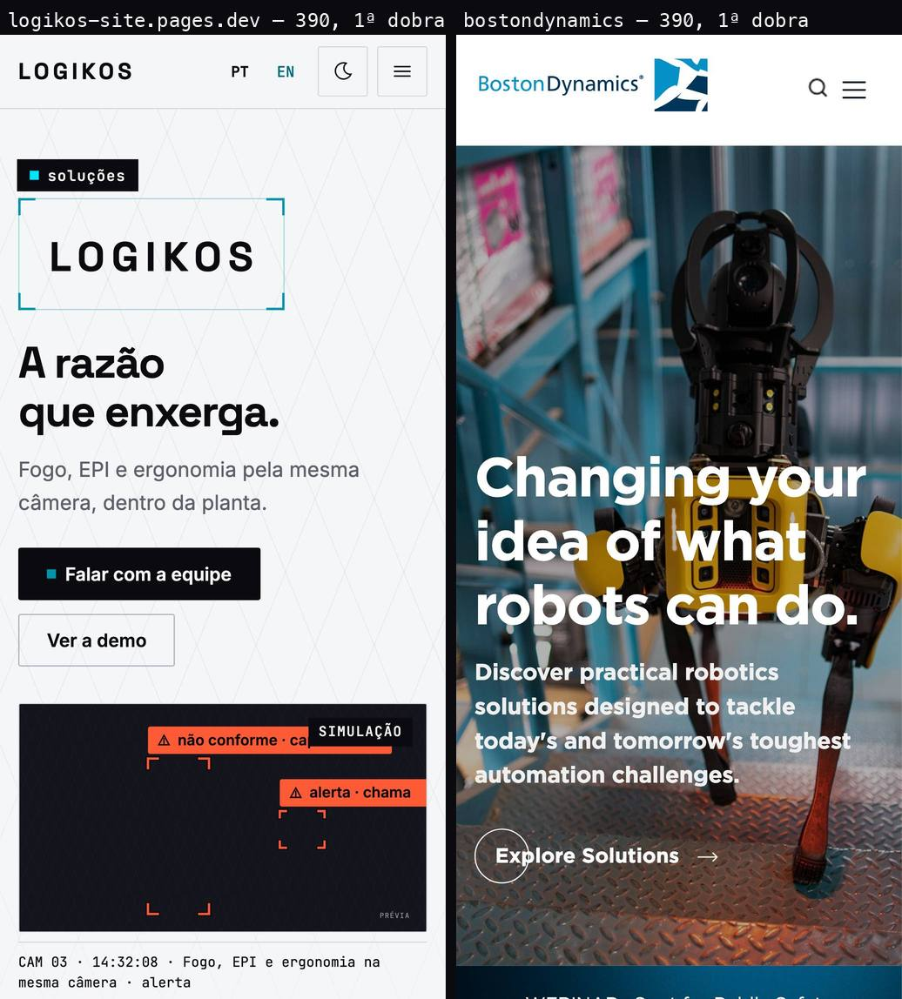

- **H1 deles:** Changing your idea of what robots can do.
- **Mídia na dobra:** A Wistia hosted background video (fast.wistia.com media v8zrtu1rqo) is the intended hero media at 1440; only its blurred placeholder swatch rendered in headless, with no identifiable product. At 390 the hero is a static photo of the Spot robot on a staircase.
- **Números:** perf 66 · LCP 7.3 s · 1542 KB · 38 img, 0 video
- **O que a diferença custa:** Vídeo Wistia (placeholder borrado no headless) a 1440; foto do Spot na escada a 390. **Custa a mobile-first**: no celular eles trocam vídeo por foto e a dobra continua com produto. A nossa dobra a 390 tem o nome, o título e nada para ver (HUD a 585 px).

### 6.4 Framework — alta performance

- **H1 deles:** "frame.work" (H1 of the Cloudflare challenge page, not the site's marketing H1 — unmeasured)
- **Mídia na dobra:** none (only the Cloudflare interstitial was ever rendered; the real page's media is unmeasured)
- **Números:** perf — · LCP — · — · unmeasured (challenge page only: 1 img,
- **O que a diferença custa:** Não medido: o Cloudflare serviu só o desafio. Fica registrado como lacuna, sem notas.

### 6.5 Intenseye — referência v2

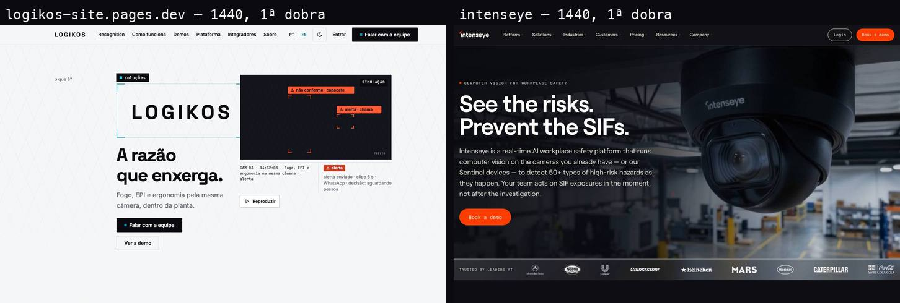

390 px

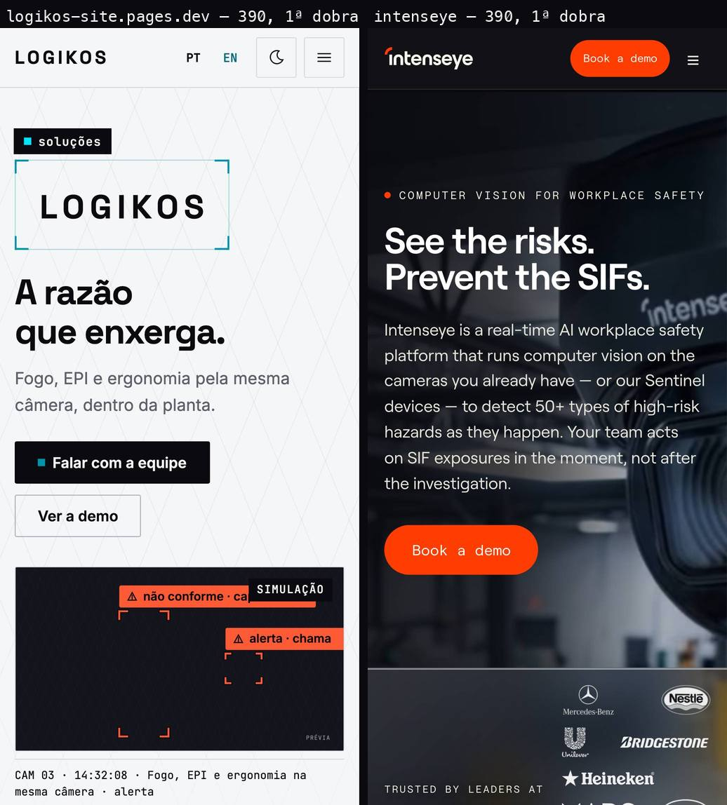

- **H1 deles:** See the risks. Prevent the SIFs.
- **Mídia na dobra:** A real photo: WebP/AVIF poster (hero-story-poster, 1280x720, ~66 KB, the Lighthouse LCP element) of the Intenseye Sentinel dome camera mounted in a warehouse, used as the hero background behind the copy. An ambient MP4 (hero-story-film.mp4, preload=none, opaci
- **Números:** perf 100 · LCP 1.5 s · 409 KB · 129 img, 6 video
- **O que a diferença custa:** Mesma categoria, mesma promessa (câmera na planta). Eles abrem com uma foto real da câmera no galpão (poster webp de 66 KB, LCP) e uma frase de ganho; nós abrimos com o nosso nome numa caixa e um poster cinza escrito SIMULAÇÃO. **Custa a credibilidade do primeiro segundo**: o visitante deles vê o produto, o nosso vê um mock. E eles fazem isso com Lighthouse 100 — a desculpa de performance não existe.

### 6.6 LandingAI — referência v2

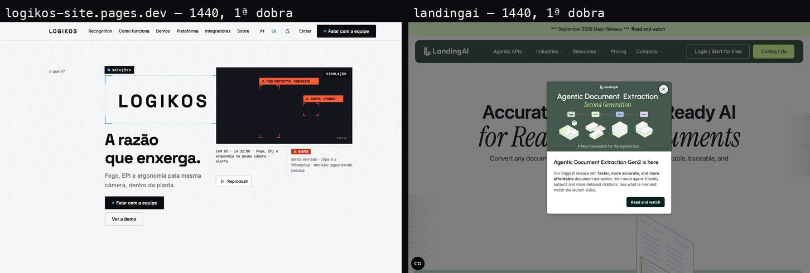

390 px

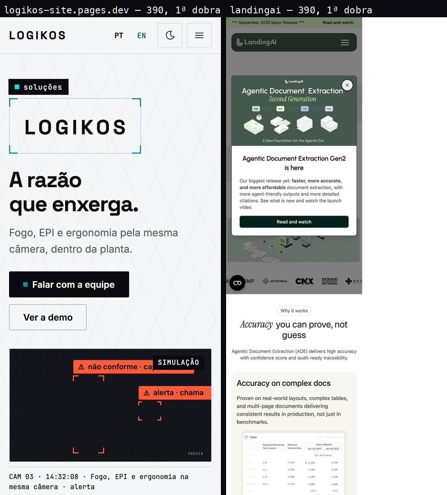

- **H1 deles:** Accurate, Production-Ready AI
- **Mídia na dobra:** none — no photo, video or product screenshot; the hero visual is a 1440x831 inline SVG isometric illustration of stacked documents, plus two decorative dot-pattern PNGs and the promo modal's 446x251 webp marketing graphic (gen2-release-popup.webp)
- **Números:** perf 41 · LCP 7.9 s · 2322 KB · 158 img, 0 video
- **O que a diferença custa:** Ilustração isométrica vetorial, sem foto, sem produto, DOM de 12 mil nós. **Custa nada**: é o que acontece quando o site vira template de SaaS. Serve como aviso.

### 6.7 Linear — referência v2

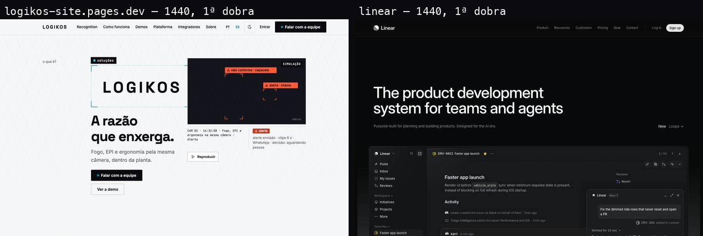

390 px

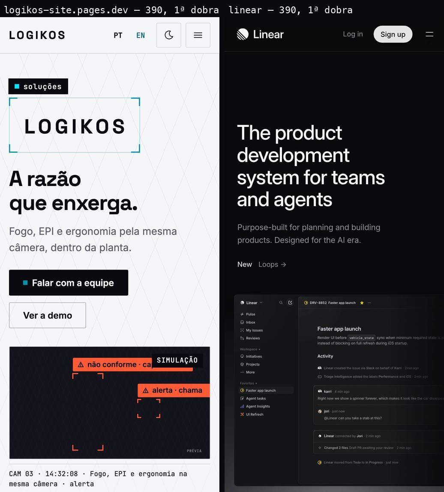

- **H1 deles:** The product development system for teams and agents
- **Mídia na dobra:** A static product screenshot/mockup of the Linear app UI (issue view DRV-8852 "Faster app launch": sidebar, activity feed, agent chat panel), rendered as an image, dark theme. No video, no photo.
- **Números:** perf 44 · LCP 16.7 s · 2866 KB · 39 img, 0 video
- **O que a diferença custa:** Screenshot estático do produto como herói, 2,9 MB, perf 44. **Custa a referência de tipografia**: uma frase curta, um screenshot nítido, zero decoração — a mesma economia que o nosso `dl` tenta e não alcança porque não tem imagem para segurar.

### 6.8 Particle — alta performance

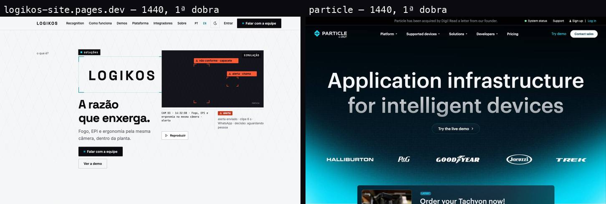

390 px

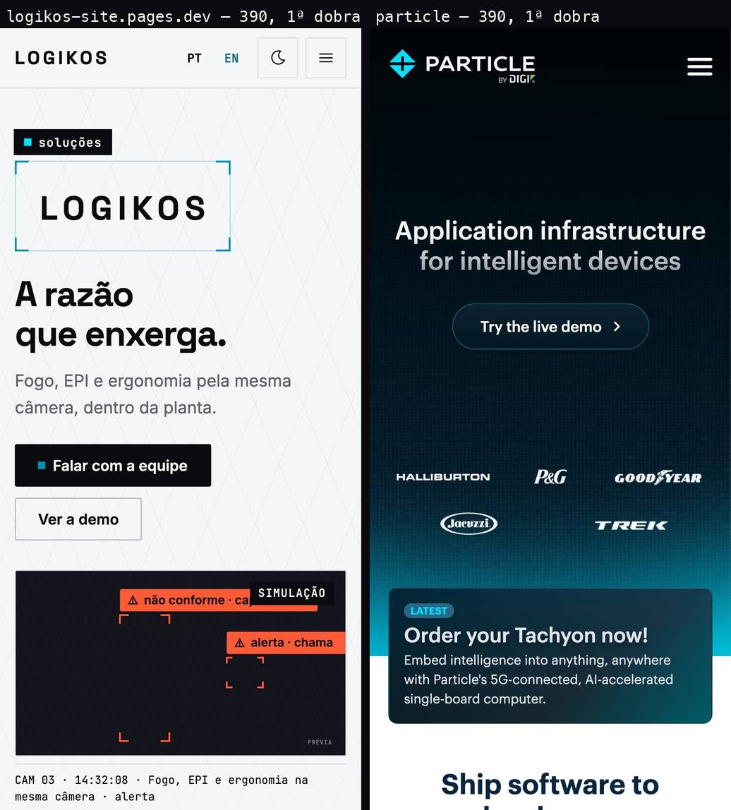

- **H1 deles:** Application infrastructure for intelligent devices
- **Mídia na dobra:** Decorative only: a 1440x858 PNG gradient background ("home-hero-background.png") and 5 customer logo PNGs. The only product media is a 238x134 Tachyon board photo (webp) cut off at the fold edge (top at y=832 of 900). No video, no screenshot in the fold.
- **Números:** perf 72 · LCP 4.6 s · 1038 KB · 64 img, 0 video
- **O que a diferença custa:** Fundo gradiente PNG, foto da placa cortada na borda da dobra, perf 72. **Custa pouco**: mostra que hardware pequeno na dobra já ancora; o nosso edge não aparece em lugar nenhum.

### 6.9 Protex AI — referência v2

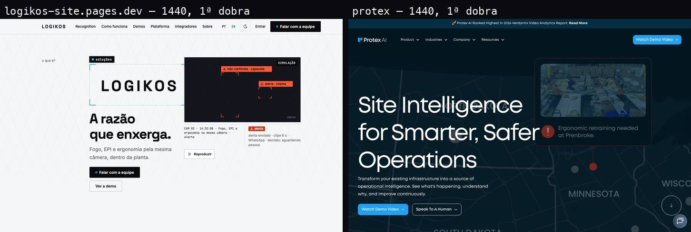

390 px

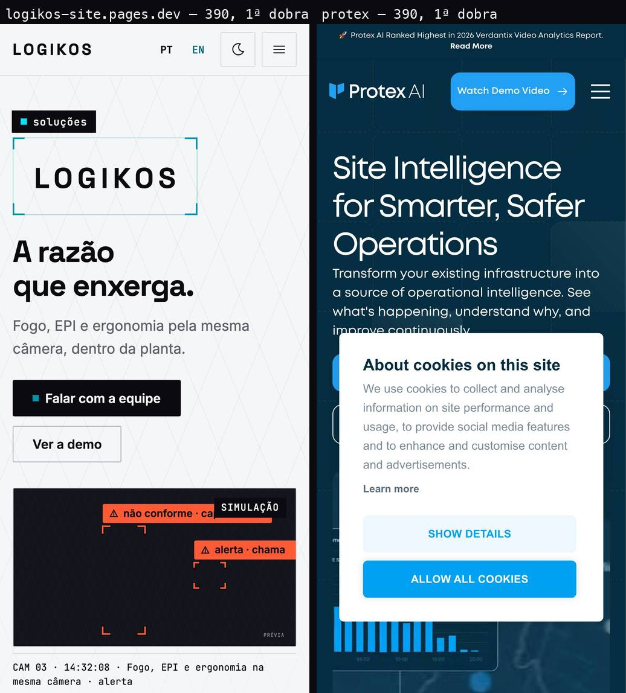

- **H1 deles:** Site Intelligence for Smarter, Safer Operations
- **Mídia na dobra:** One full-bleed 1440x900 background <video> (herobgvideo.webm: animated dark US map with stylised dashboard/alert cards and small CCTV thumbnails) plus a 100x96 HubSpot chat iframe; no photo or real product screenshot.
- **Números:** perf 26 · LCP 9.1 s · 52069 KB · 149 img, 15 video (Lighthouse warned the
- **O que a diferença custa:** Vídeo de fundo com mapa e cartões animados, sem produto real, 92 MB de tráfego, perf 10. **Custa nada para nós** — é o contra-exemplo: mídia pesada que não prova nada. Não copiar.

### 6.10 Samsara — alta performance

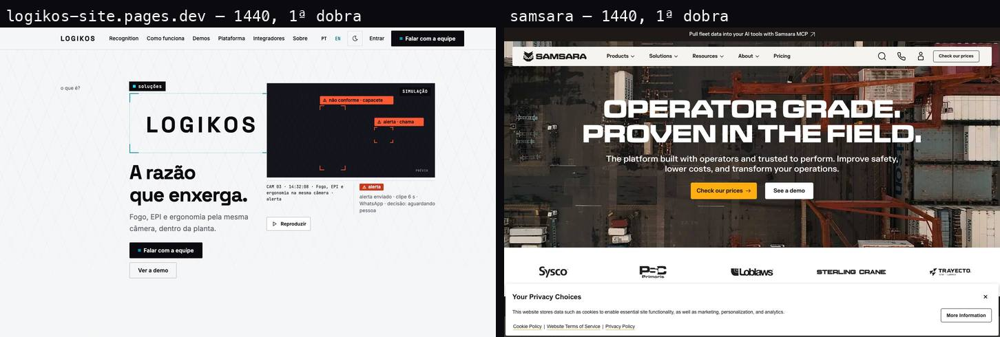

390 px

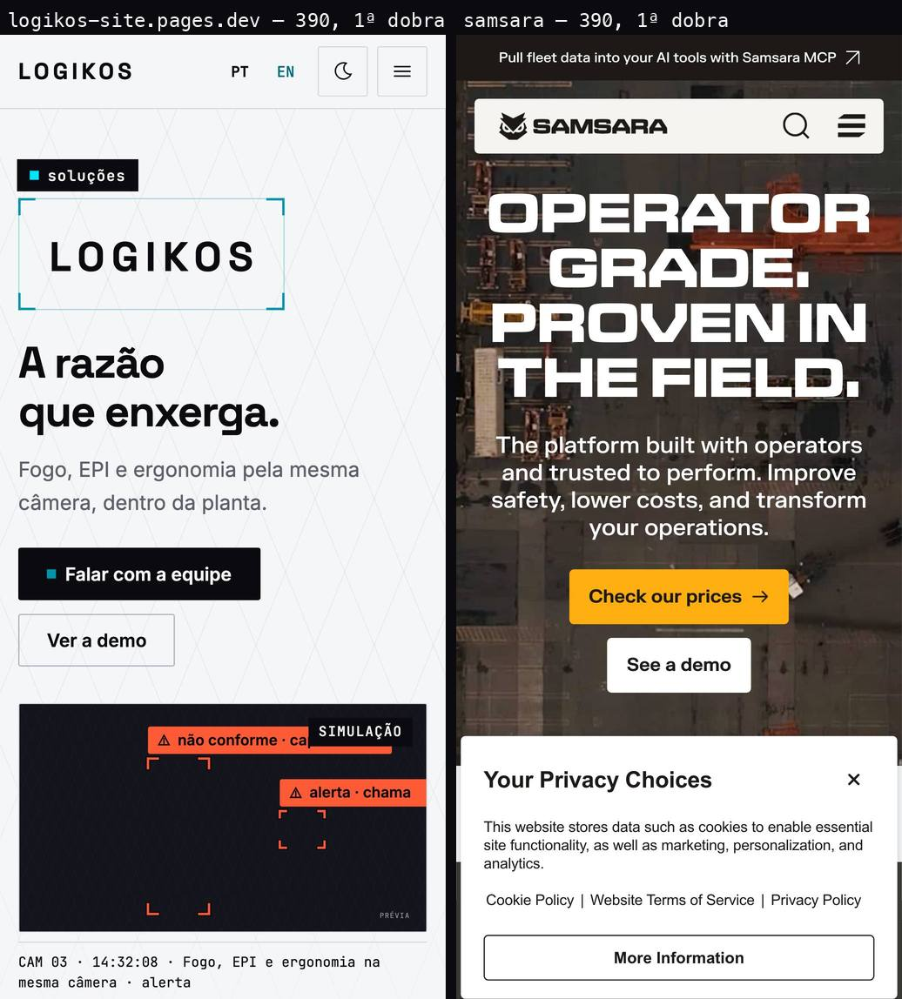

- **H1 deles:** OPERATOR GRADE. PROVEN IN THE FIELD.
- **Mídia na dobra:** One static photograph: a Contentful  (1440x640) aerial shot of a shipping-container yard with orange gantry cranes and trucks. It is customer-environment imagery, not the Samsara product (no hardware, no dashboard). No video in the fold (the page's 2 vide
- **Números:** perf 27 · LCP 14.2 s · 7130 KB · 79 img, 1 video (mobile 390); 86 img, 2
- **O que a diferença custa:** Foto aérea de pátio de contêineres (ambiente do cliente, não produto), 1 vídeo, perf 27. **Custa a referência de headline**: 'OPERATOR GRADE. PROVEN IN THE FIELD.' é promessa de campo em cinco palavras; a nossa é a glosa do nome.

### 6.11 Stripe — alta performance

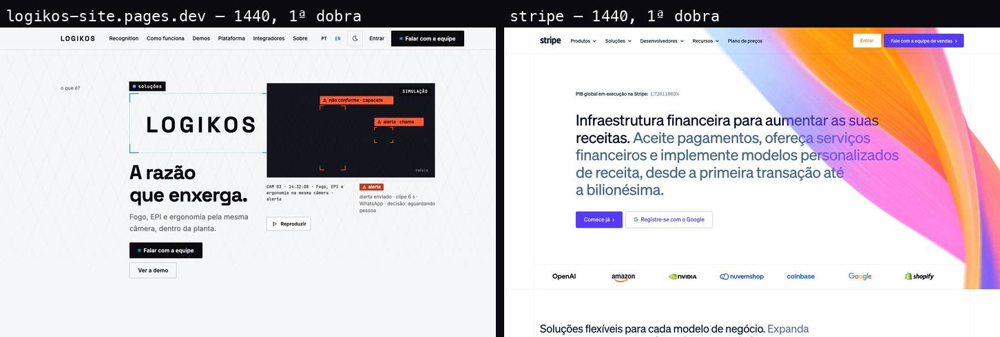

390 px

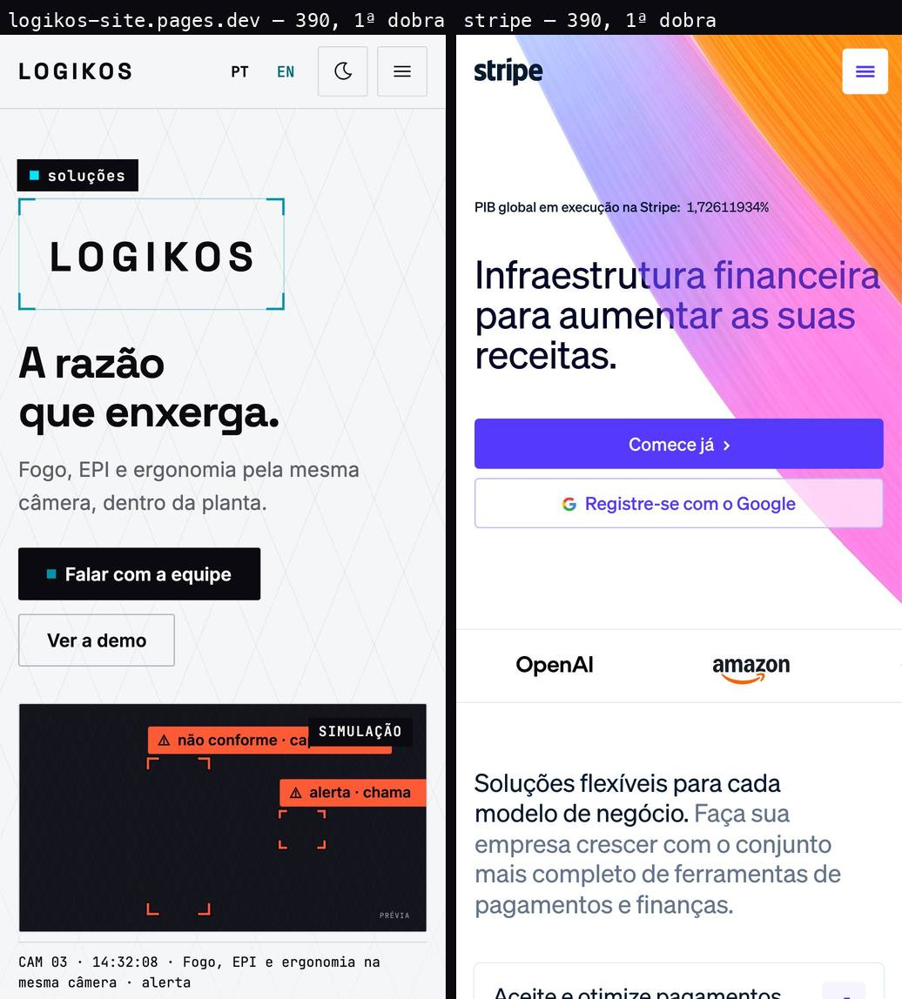

- **H1 deles:** Infraestrutura financeira para aumentar as suas receitas.
- **Mídia na dobra:** none — no photo, video or product screenshot; hero visual is an abstract animated gradient wave (canvas 1393x761 plus a wave-fallback-desktop-1x image at 1392x975). Page has 0 <video>.
- **Números:** perf 54 · LCP 4.5 s · 2113 KB · 36 img, 0 video
- **O que a diferença custa:** Onda abstrata em canvas, sem foto, sem produto; perf 54. **Custa nada em mídia** — Stripe vende infraestrutura invisível e pode abstrair; visão computacional não pode. A referência é o rigor de grid e tipografia, não o herói.

### 6.12 Vercel — alta performance

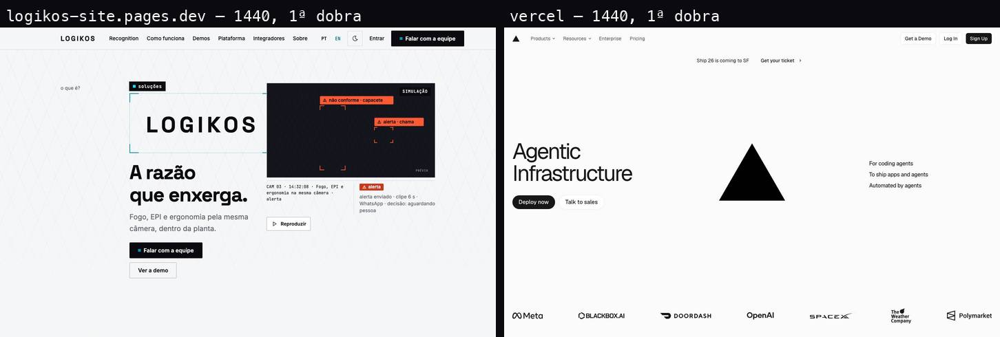

390 px

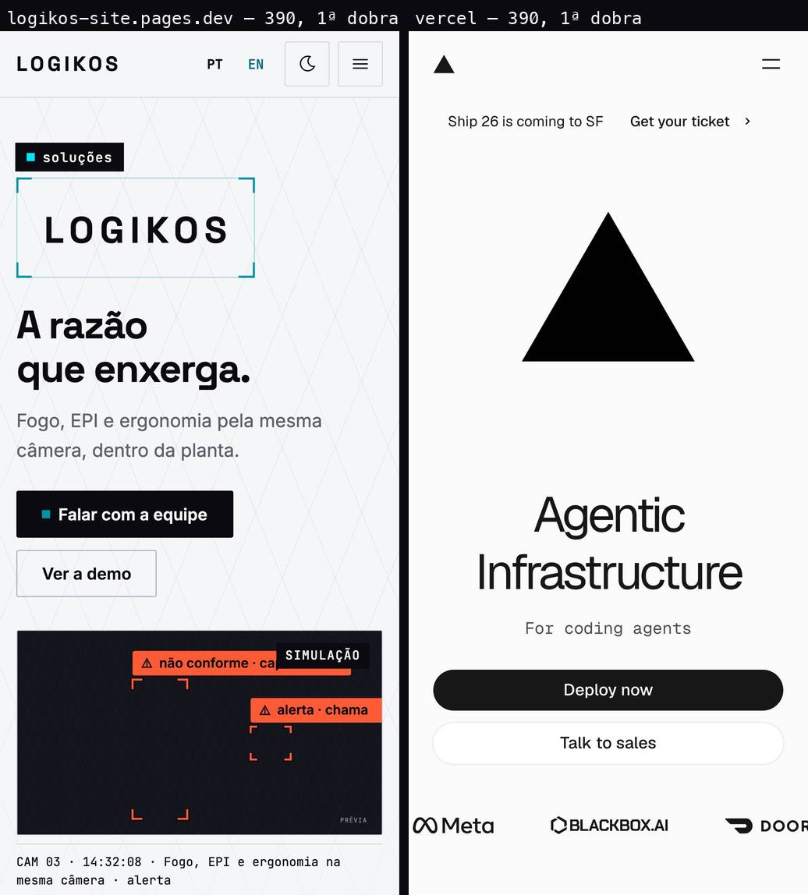

- **H1 deles:** Agentic Infrastructure
- **Mídia na dobra:** none — only the vector Vercel triangle mark and SVG partner wordmarks; no photo, video or product screenshot in the first fold at 1440 (and none at 390).
- **Números:** perf 65 · LCP 7.0 s · 1908 KB · 19 img, 0 video
- **O que a diferença custa:** Só o triângulo vetorial e logos de parceiros; perf 65. **Custa a lição de prova social**: eles não têm foto porque têm 20 logos. Nós não temos nem um nem outro (trava de cliente) — então a prova tem de ser a demo ao vivo.

### 6.13 Verkada — referência v2

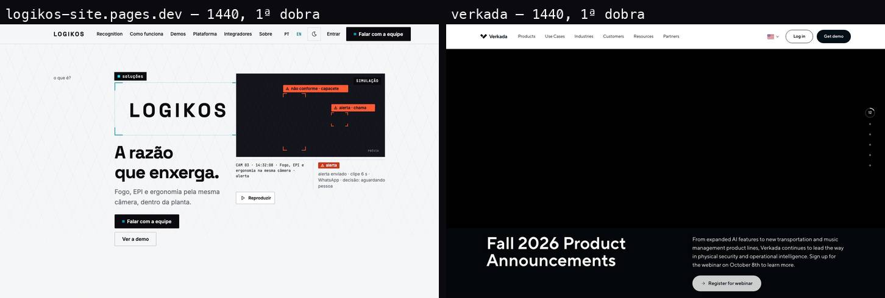

390 px

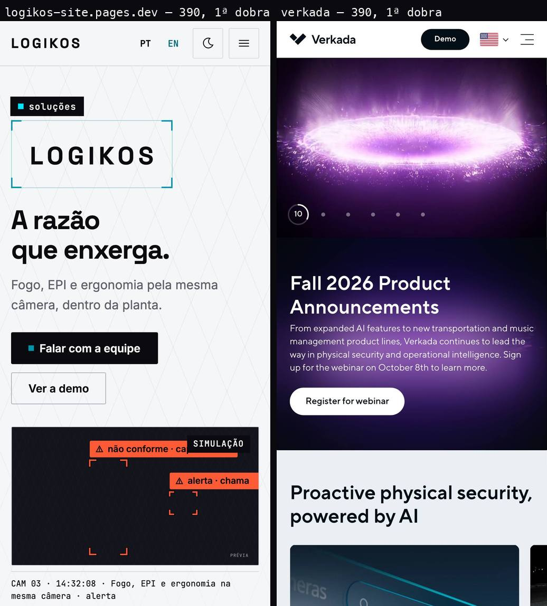

- **H1 deles:** Fall 2026 Product Announcements
- **Mídia na dobra:** An autoplaying hero video carousel (6 videos, "Click for sound" control) fills the fold, but it rendered black in the 1440 capture and shows only an abstract purple light-ring frame at 390. No photo, product shot, or UI screenshot in the fold; real product ima
- **Números:** perf 32 · LCP 18.1 s · 7276 KB · 71 img, 8 video (390); 72 img, 8 video (
- **O que a diferença custa:** Carrossel de 6 vídeos autoplay que renderizou preto no headless. **Custa a lição**: vídeo que depende de JS para existir é vazio para metade dos robôs e para quem tem dados limitados. O poster tem de ser a prova, o vídeo o bônus.

### 6.14 Viam — referência v2

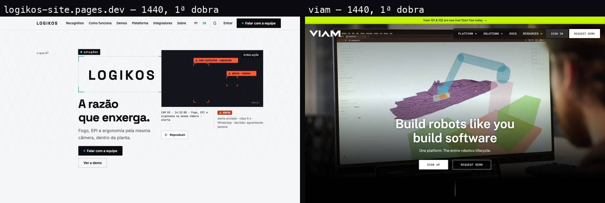

390 px

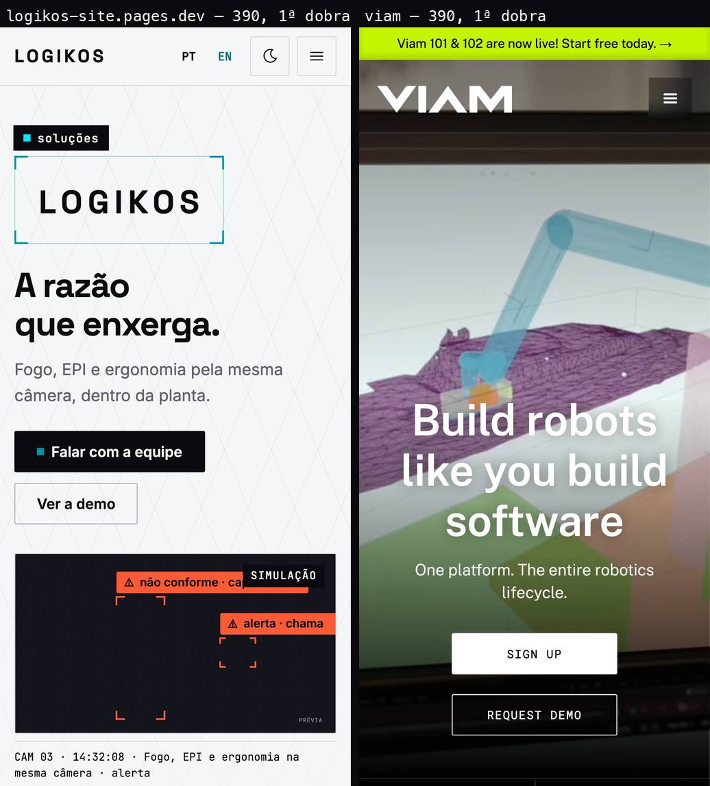

- **H1 deles:** Build robots like you build software
- **Mídia na dobra:** Background hero video (Webflow-hosted mp4, 1440x750, autoplay) showing a person at a monitor running the Viam app's 3D visualizer: a blue robot-arm model over a purple point-cloud mesh with green/orange collision boxes. No static photo or screenshot; the only
- **Números:** perf 29 · LCP 13.2 s · 6712 KB · 51 img, 2 video
- **O que a diferença custa:** Vídeo da tela do produto (visualizador 3D) atrás da headline. **Custa a demonstração**: eles mostram o software rodando antes de explicar; nós explicamos sem mostrar.

### 6.15 Voxel — referência v2

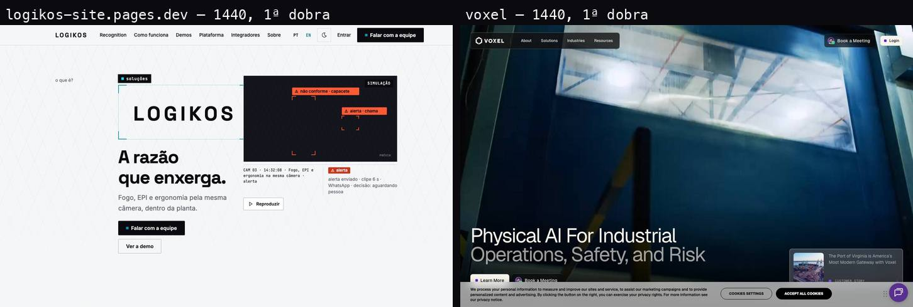

390 px

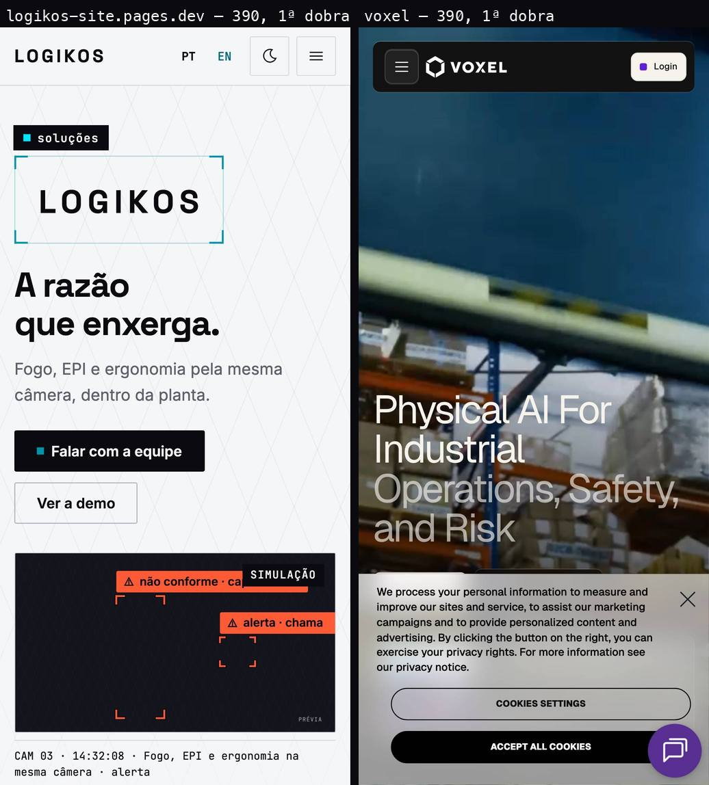

- **H1 deles:** Physical AI For Industrial Operations, Safety, and Risk
- **Mídia na dobra:** Autoplay muted looping background video "Homepage Montage_4K_V4" (mp4/webm, jpg poster) of industrial-facility footage, not the product; plus a small Port of Virginia photo thumbnail in a customer-story card. No screenshot of the software.
- **Números:** perf 28 · LCP 8.1 s · 19552 KB · 153 img, 5 video
- **O que a diferença custa:** Montagem de fábrica em vídeo mudo, promessa 'Physical AI'. Mídia real, mas de ambiente, não de produto. **Custa pouco**: mostra que vídeo de ambiente já passa a sensação de 'isto existe' que o nosso poster não passa.

### 6.16 O que os auditores leram nos pares

**Auditor 1**

| Dimensão   | Benchmark | Largura | Página Logikos | O que a diferença custa                                                                                                                                                                                                                                                                              |
| ---------- | --------- | ------- | -------------- | ---------------------------------------------------------------------------------------------------------------------------------------------------------------------------------------------------------------------------------------------------------------------------------------------------- |
| 5 s        | intenseye | 1440    | `home`         | Intenseye: eyebrow 'COMPUTER VISION FOR WORKPLACE SAFETY', H1 'See the risks. Prevent the SIFs.' e a foto da câmera no galpão; Logikos: chip 'soluções', LOGIKOS numa caixa, 'A razão que enxerga.' e um painel escuro vazio — os 5 segundos acabam sem o visitante saber que é visão computacional. |
| Proposta   | stripe    | 1440    | `plataforma`   | Stripe diz o resultado no H1 ('aumentar as suas receitas'); Logikos diz o processo ('A conversa define qual serve') — o comprador sai sabendo que vai haver uma reunião, não o que leva.                                                                                                             |
| Prova      | intenseye | 390     | `home`         | Intenseye: foto WebP de 66 KB da câmera Sentinel como LCP, Lighthouse 100; Logikos: retângulo #14141C com colchetes em volta do nada e o selo SIMULAÇÃO, Lighthouse 98 — a mesma nota, com e sem produto na tela.                                                                                    |
| Hierarquia | linear    | 390     | `home`         | Linear a 390: H1, uma linha de subtítulo e o screenshot do produto dentro dos 844 px; Logikos: chip, caixa com o nome, H1, lede, dois botões e o estágio só a 585 px, cortado pela dobra.                                                                                                            |
| Marca      | axis      | 1440    | `home`         | Axis: lockup completo (wordmark + símbolo) no canto do header em todas as páginas; Logikos: 'LOGIKOS' em Space Grotesk tracked — a fechadura que define a marca não existe em nenhum pixel do site.                                                                                                  |
| Copy       | samsara   | 1440    | `integradores` | Samsara: 'OPERATOR GRADE. PROVEN IN THE FIELD.' + 'Check our prices' — cada botão diz o que acontece; Logikos: 'Seu cliente, sua marca, nosso reconhecimento.' (bom) + 'Quero ser parceiro' que leva a um formulário que responde 503.                                                               |
| Uso        | particle  | 390     | `home`         | Particle: 'Try the live demo' é o único botão sob o H1; Logikos: 'Ver a demo' leva a uma página e as demos reais são links de texto a 3.400 px da dobra.                                                                                                                                             |
| 390 px     | linear    | 390     | `recognition`  | Linear: zero elemento cortado na dobra de 390; Logikos /recognition: 9 chips além da borda do estágio e o selo em cima do primeiro chip — a 'prova' chega ilegível no telefone.                                                                                                                      |
| A11y       | viam      | 390     | `plataforma`   | Viam e Logikos marcam 100 no axe; a diferença não aparece na nota: checkboxes de 18 px e 'Reproduzir' de 40 px na Logikos, com um H1 que o leitor de tela anuncia como 'edge ou nuvem? Dois modos…'.                                                                                                 |
| Perf       | intenseye | 390     | `home`         | Intenseye: 100, LCP 1,5 s, 409 KB com foto e 61 KB de fontes; Logikos: 98–100, LCP 1,6 s, 210 KB sem imagem e 108 KB de fontes — metade do peso é tipografia e nada é produto.                                                                                                                       |
| Motion     | vercel    | 1440    | `home`         | Vercel: triângulo estático, zero entrada, zero custo; Logikos: glitch de 0,5 s uma vez por sessão e depois repouso — custo igual a zero, mas no celular (handheld → idle) o estágio nunca toca e o visitante só vê um quadro parado.                                                                 |
| Confiança  | linear    | 1440    | `plataforma`   | Linear: 'Sign up' → /signup funciona; Logikos: 'Pedir acesso' → captcha de teste → 503, e 'Entrar' → frontend-production-bf96.up.railway.app — o site parece de teste porque, em produção, é.                                                                                                        |

**Auditor 2**

| Dimensão   | Benchmark | Largura | Página Logikos | O que a diferença custa                                                                                                                                                                                                                                                                                                       |
| ---------- | --------- | ------- | -------------- | ----------------------------------------------------------------------------------------------------------------------------------------------------------------------------------------------------------------------------------------------------------------------------------------------------------------------------- |
| 5 s        | intenseye | 1440    | `home`         | Intenseye: dome com o logo gravado, eyebrow 'computer vision for workplace safety', 'See the risks. Prevent the SIFs.'; Logikos: 'LOGIKOS' no header, 'LOGIKOS' de 64 px numa caixa, 'A razão que enxerga.' e um retângulo preto — o visitante sabe o nome e não sabe o produto.                                              |
| Proposta   | intenseye | 390     | `home`         | Intenseye em 5 linhas diz 'cameras you already have', '50+ hazards', 'act in the moment'; Logikos põe o ganho ('pela mesma câmera, dentro da planta') em cinza 20 px abaixo de uma glosa do nome — o ganho é o lede, não o título.                                                                                            |
| Prova      | linear    | 1440    | `recognition`  | Linear corta a dobra com a janela real do app (issue DRV-8852, sidebar, feed, painel de agente); Logikos mostra dois chips laranja e cantos de caixa sobre preto carimbado SIMULAÇÃO/PRÉVIA — um prova que o produto existe, o outro prova que ainda não tem imagem.                                                          |
| Hierarquia | vercel    | 1440    | `home`         | Vercel: um H1, um triângulo, dois botões, 60 % de ar; Logikos: chip 'soluções', caixa ciano, LOGIKOS, H1, lede, 2 botões, quadro, legenda de 3 linhas, chip, 'Reproduzir' — dez objetos e nenhum ousado.                                                                                                                      |
| Marca      | intenseye | 390     | `home`         | Intenseye a 28 px tem o tick laranja no 'i' que identifica a marca de longe; Logikos tem letras de Space Grotesk tracked-out que qualquer um digita — a fechadura no O e o L em Λ, únicos sinais proprietários, estão num SVG que não foi para o site.                                                                        |
| Copy       | intenseye | 1440    | `plataforma`   | Intenseye: 'runs computer vision on the cameras you already have... your team acts in the moment, not after the investigation'; Logikos: 'Dois modos. A conversa define qual serve.' / 'Sem preço público. A proposta vem da conversa.' — um fala com o comprador, o outro fala do processo de venda.                         |
| Uso        | stripe    | 390     | `home`         | Stripe: 'Comece já' em largura total no primeiro toque; Logikos: 'Ver a demo' fantasma a 60 % que leva a uma página de mocks, e a demo real 'no ar' é um link de 14 px a 2400 px de rolagem.                                                                                                                                  |
| 390 px     | linear    | 390     | `home`         | Linear: screenshot do app ocupa 40 % da dobra sem cortar nada; Logikos: 'não conforme · ca' cortado pelo selo SIMULAÇÃO e 'alerta · chama' saindo pela borda direita (overflow 3) — o elemento memorável chega quebrado no telefone.                                                                                          |
| A11y       | viam      | 1440    | `plataforma`   | Viam (a11y 100): botões SIGN UP / REQUEST DEMO de 48 px; Logikos (a11y 100 no axe) tem o campo 'Quantas câmeras' com 23 px de altura e sete checkboxes de 18 px — o score não vê o alvo pequeno, o dedo vê.                                                                                                                   |
| Perf       | intenseye | 390     | `home`         | Intenseye: 100 e LCP 1,5 s carregando um poster WebP de 66 KB da dome; Logikos: 98 e LCP 1,6 s com 0 imagens e 108 KB de fontes (51 % do peso) — quando a primeira foto entrar, a Logikos cai e a Intenseye continua em 100.                                                                                                  |
| Motion     | axis      | 1440    | `home`         | Axis: Ken Burns de 5 s que termina em repouso sobre uma foto da planta com a dome no teto; Logikos: steps() que termina em repouso sobre um retângulo preto — a gramática está certa, o movimento revela nada.                                                                                                                |
| Confiança  | intenseye | 1440    | `demos`        | Intenseye: foto do hardware com o próprio logo e faixa de nove clientes; Logikos (sem clientes citáveis): carimbos SIMULAÇÃO e PRÉVIA, 'CAM 07 · 09:14:50' inventado, 'Demo genérica de detecção. Não é o modelo de EPI da planta.' em mono e botão 'Pedir acesso' que responde 503 — o site rotula a si mesmo como rascunho. |

## 7. As 12 afirmações do briefing, uma a uma

Cada afirmação foi conferida no código de `main` (`a7f7582`) e na captura de produção de 03/10/2026. "Confirmada" = o código e a tela mostram o que o briefing diz; "parcial" = o sintoma existe, a causa descrita não é essa; "derrubada" = não acontece em produção.

| #   | Afirmação                                                                                     | Veredito                                          | Prova (`arquivo:linha` em `main`)                                                                                                                                                                                                                                                                                                                                                                                                                                                                                                                                                                   |
| --- | --------------------------------------------------------------------------------------------- | ------------------------------------------------- | --------------------------------------------------------------------------------------------------------------------------------------------------------------------------------------------------------------------------------------------------------------------------------------------------------------------------------------------------------------------------------------------------------------------------------------------------------------------------------------------------------------------------------------------------------------------------------------------------- |
| 1   | O wordmark em produção é texto puro, sem a fechadura no O e sem o L no ângulo do Λ            | **Confirmada**                                    | `src/components/Logo.astro:25-26` renderiza `LOGIKOS` em Space Grotesk 700 com tracking .16em; usado em `Header.astro:25`, `BrandBox.astro:23`, `[marca].astro:67-68`. O rodapé usa o monograma Λ (`Footer.astro:32`). O OG desenha o nome como texto (`src/lib/og.ts:70`). O favicon é só o monograma (`scripts/gen-icons.mjs:7`). Captura: `evidencias/04-wordmark-sem-fechadura.png`, `auditoria/logikos/home-1440-light-fold.jpg`.                                                                                                                             |
| 2   | O herói da home abre com o próprio nome numa caixa, e não com o ganho do comprador            | **Confirmada**                                    | `src/views/HomeView.astro:36-37` põe `<BrandBox glitch>` acima do `h1`; o título vem de `src/i18n/pt-br.json:137` ("A razão que enxerga" como h1). O nome aparece três vezes na primeira dobra (header, caixa, h1-glosa). Captura: `evidencias/01-home-desktop-hero.png`.                                                                                                                                                                                                                                                                                                                           |
| 3   | Não há nenhuma imagem nem vídeo real em nenhuma página                                        | **Confirmada**                                    | `src/data/media.ts:14-23`: nenhum slot lista `video`; `0 ` e `0 <video>` em todas as 10 páginas medidas (`auditoria/logikos/metrics.json`). O estágio mostra o poster SVG gerado (`src/lib/poster.ts:92-118`) com a grade grega e o rótulo "SIMULAÇÃO".                                                                                                                                                                                                                                                                                                                                        |
| 4   | Os chips do HUD estouram o estágio no celular                                                 | **Confirmada**                                    | `src/components/HudVideo.astro:179-182`: `chipW` é calculado em px de CSS e escalado por `k`, sem clamp à largura do estágio; `chipY` só evita o topo, nunca as bordas laterais. Medido: 3 chips fora do estágio no herói a 390 (2 a 1440) e 7–9 no estágio de fogo (`metrics.json → huds[].overflow`). Captura: `evidencias/02-home-mobile-hero-chips-estourando.png`.                                                                                                                                                                                                                             |
| 5   | Chips se sobrepõem porque o poster e o overlay desenham o mesmo veredito duas vezes           | **Parcial — sintoma confirmado, causa derrubada** | Em produção, `.hud[data-state] .hud-poster__verdict { display: none }` (`HudVideo.astro:555`) esconde o veredito do poster assim que o script assume; conferido no DOM da captura. A sobreposição real ("✓ c✓ conforme · capacete") vem de **dois chips ancorados no mesmo `y`**: `frameToBoxes` cria um chip para a pessoa (`src/lib/hud.ts:115`) e outro para cada EPI com bbox (`hud.ts:119`), e `boxSvg`/`drawBox` ancoram ambos em `y - chipH - gap` (`poster.ts:60`, `HudVideo.astro:182`) sem detecção de colisão. Captura: `evidencias/03-recognition-chips-sobrepostos-estagio-vazio.png`. |
| 6   | Há rótulos em caixa alta com tracking (eyebrows) e perguntas na margem que não respondem nada | **Confirmada**                                    | `.eyebrow` em `src/styles/global.css` (uppercase + letter-spacing); usados em `HomeView.astro:57,65` ("Para a sua planta", "Para integradores") e `404.astro:15` ("404"). A pergunta de margem "o que eu ganho?" (`pt-br.json`, `home.questions.gain`) é respondida por um título "Por onde você entra" — pergunta e resposta não se encontram. Medido: 3 textos uppercase tracked-out na home, 1 nas demais (`metrics.json → uppercaseTracked`).                                                                                                                                                   |
| 7   | Toda página abre com um "cover" idêntico (mesma anatomia de herói)                            | **Confirmada**                                    | `src/components/Section.astro` com `cover` em todas as views; 11 páginas abrem com pergunta-na-margem + h1 + lede + botões, sem mídia própria. `pt-br.json:801`: o h1 de `/plataforma` é "Dois modos. A conversa define qual serve." — frase de briefing interno, não de comprador. Captura: `evidencias/06-plataforma-headline-de-briefing.png`.                                                                                                                                                                                                                                                   |
| 8   | O cartão de alerta mostra botões que parecem clicáveis e não são                              | **Confirmada**                                    | `src/components/AlertCard.astro:60-65`: `Confirmar`, `Descartar`, `Corrigir` são `` com borda, raio e padding de botão (`:133-142`), sem `button`, sem foco, sem ação.                                                                                                                                                                                                                                                                                                                                                                                                  |
| 9   | O link das demos está escondido e não é o botão primário                                      | **Confirmada**                                    | `HomeView.astro:92-97`: `/demos` é um `<a>` inline (`:96`) no fim de um parágrafo, depois de dois chips de status; o botão primário da home é o WhatsApp. Em `/demos` (`DemosView.astro:40`) o botão "Abrir demo" vem depois de um bloco `dl` e abaixo da dobra a 390 (`demos-390-light-fold.jpg`). Captura: `evidencias/05-demos-link-escondido.png`.                                                                                                                                                                                                                                              |
| 10  | Tabelas `dl` são usadas como layout geral, não só para comparação                             | **Confirmada**                                    | `DefList` importado em 9 das 13 views (`grep -l DefList src/views`); na home, "portas" e "próximo passo" são `dl` sem termo comparado; em `/plataforma` e `/integradores`, 3–4 `dl` por página.                                                                                                                                                                                                                                                                                                                                                                                                     |
| 11  | Fontes pesam mais do que o resto da página                                                    | **Confirmada**                                    | `src/layouts/Base.astro:2-4,63-65` importa e pré-carrega três famílias variáveis latin completas (22 + 48 + 40 KB = 108 KB woff2) em todas as páginas: 51 % do peso da home (210 KB) e 72 % de `/como-funciona` (149 KB). Nenhum subset por página.                                                                                                                                                                                                                                                                                                                                                 |
| 12  | Tema escuro e `prefers-reduced-motion` não foram conferidos a olho                            | **Confirmada (agora conferidos)**                 | Capturas `*-dark.jpg` para 10 páginas × 2 larguras; teclado e `reduced-motion` em `keyboard-prod.json`. Resultado: escuro segue os tokens (sem regressões de contraste visíveis), `reduced-motion` deixa o estágio no último quadro, como desenhado. Isto é, a dívida era de **conferência**, não de código.                                                                                                                                                                                                                                                                                        |

### 7.1 Ressalvas de medição

- **Lighthouse em paralelo mente.** Os 15 benchmarks foram medidos primeiro com 5 páginas em paralelo (`lighthouse_parallel` no JSON) e depois, para os 7 que importam, um por vez numa máquina parada (`lighthouse`). Intenseye foi de 92 → **100**, Stripe 41 → 54, Vercel 50 → 65. A tabela usa sempre o valor sequencial; onde só há o paralelo, está marcado.
- **SEO 66 em todas as páginas** é o `X-Robots-Tag: noindex` do domínio `pages.dev` (decisão 0017: produção só indexa quando o DNS virar). Não é um defeito da página; some sozinho na troca de domínio. O resto do SEO (title, description, canonical, hreflang, OG) está em 100.
- **Intenseye faz 100 com uma foto real de 66 KB como LCP.** O nosso 98–100 é feito com `0 `; o LCP é um parágrafo. Performance sem conteúdo é ausência de conteúdo, não mérito. A meta da Fase B é manter ≥ 95 **com** mídia real (poster webp ≤ 60 KB como LCP, vídeo lazy).
- **Frame.work não foi medido**: o Cloudflare serviu só o interstitial. Fica com screenshot do desafio, sem notas.
- **Protex** carregou 92 MB de vídeo e o Lighthouse avisou que a página não terminou no tempo; perf 10 é limite inferior.
- Capturas de produção são de `logikos-site.pages.dev` em 03/10/2026, Chromium headless, 390×844 e 1440×900, claro e escuro, `reduced-motion` ligado para as de teclado.
- **Errata (PR-B, 03/10/2026): o contador de "chips fora do estágio" estava inflado.** `audit-capture.mjs` somava os chips do poster escondidos por `display: none` (retângulo 0×0 na origem, logo "à esquerda do estágio"). Com o filtro corrigido, a produção em repouso tem **1 chip fora no herói a 360/390 e 1 em `/demos`** — não 3 e 7–9 como na tabela 8.1 e na afirmação 4. O defeito existia (evidências 02 e 03 mostram o chip cortado e o selo em cima dele) e está fechado no PR-B (0 em todas as páginas, `auditoria/pr-b/depois/metrics.json`); os quadros intermediários da reprodução não foram medidos.

### 7.2 O que cada auditor concluiu sobre as 12 afirmações

| #   | Auditor 1                                                                                                                                                                                                                                                                                                                                                                                                                                        | Auditor 2                                                                                                                                                                                                                                                                                                                                                                               |
| --- | ------------------------------------------------------------------------------------------------------------------------------------------------------------------------------------------------------------------------------------------------------------------------------------------------------------------------------------------------------------------------------------------------------------------------------------------------ | --------------------------------------------------------------------------------------------------------------------------------------------------------------------------------------------------------------------------------------------------------------------------------------------------------------------------------------------------------------------------------------- |
| 1   | **confirmado** — Logo.astro:25-28 span .lk-wordmark 'LOGIKOS'; Header.astro:25; BrandBox.astro:23; Footer.astro:32 monograma a 32 px (acima do limite de 24 px do README); HTML de produção contém '. README oficial: glosa, não slogan; slogan 'Onde a lógica encontra a visão.' = 0 ocorrências. Tela: home-1440-light-fold.jpg com LOGIKOS no header e a 64 px na caixa.       |
| 3   | **confirmado** — media.ts:14-23 sem campo video; poster.ts:78-106 gera o SVG; metrics img 0 / video 0 nas 20 medições; HTML de produção de /recognition: 6 .hud__poster inline, 6 <pattern>, 45 <svg>.                                                                                                                                                                                                                                           | **confirmado** — media.ts:14-23 nenhum slot com video; poster.ts:50-75 gera SVG de caixas sobre retângulo; metrics.json img:0 video:0 nas 20 medições. Tela: todos os quadros são retângulo preto com chips.                                                                                                                                                                            |
| 4   | **confirmado** — HudVideo.astro:177 chipW por text.length; :182 translate(x) sem clamp; :179 só clamp vertical; :512-522 badge absoluto top/right; poster.ts:59-60 mesma lógica; metrics overflow home 3/2, recognition 9, demos 4, fire 7; evidência 02.                                                                                                                                                                                        | **confirmado** — HudVideo.astro:179 chipY só clamp vertical; :182 translate(x, chipY) sem limitar x+chipW a POSTER_W; :512-522 .hud__badge absoluto top/right. metrics overflow hero 3/2, fire 7–9, demos epi 4. Tela: home-390-light-fold.jpg 'não conforme · ca' cortado pelo SIMULAÇÃO.                                                                                              |
| 5   | **confirmado** — Poster some via HudVideo.astro:555-559 (.hud[data-state] .hud-poster__verdict display:none) — não é poster+overlay. hud.ts:115 (pessoa) e :119 (item) geram dois chips com chipY = y - chipH - gap (HudVideo.astro:179, poster.ts:60) quando as caixas começam no mesmo y. Também ocorre em /demos (demos-390-light-fold.jpg). Estágio 'vazio': poster.ts:93 rect #14141C sem imagem.                                           | **confirmado** — Causa confirmada como colisão (não poster+overlay): hud.ts:115 caixa da pessoa, :119 caixa da região; hero.json/epi.json bbox pessoa e cabeça com y=0.24 → chipY idêntico em HudVideo.astro:179 e poster.ts:60. Tela: evidencias/03 '✓ c✓ conforme · capacete'; caixas de corpo inteiro sobre nada.                                                                    |
| 6   | **confirmado** — global.css:199-207 uppercase + letter-spacing .08em; HomeView.astro:57,65; 404.astro:15; HudVideo.astro:518 (selo também uppercase); metrics uppercaseTracked; pt-br.json:183 'o que eu ganho?' vs :141 'Por onde você entra'.                                                                                                                                                                                                  | **confirmado** — HomeView.astro:57,65 class=eyebrow; global.css:199-218 mono uppercase tracking .08em; 404.astro:15. pt-br.json:183 'o que eu ganho?' vs :141 'Por onde você entra'. metrics uppercaseTracked lista as três. Nota: .q é display:none < 64rem (global.css:155), então no celular a pergunta nem aparece e o título responde sozinho.                                     |
| 7   | **confirmado** — Section.astro:23-40 cover em RecognitionView:33, DemosView:21, PlatformView:20, PartnersView, HowItWorksView; pt-br.json:801; folds a 1440 de recognition/demos/plataforma/integradores são a mesma composição grade + pergunta + H1 + lede. Nuance: /como-funciona tem um CTA próprio (HowItWorksView.astro:35-36), mas é o mesmo fallback 'Falar com a equipe'.                                                               | **confirmado** — Section.astro:22-35 prop cover → greek-grid + q + display + lede em RecognitionView:33, DemosView:21, PlatformView:20, PartnersView, HowItWorksView; pt-br.json:801. Tela: as quatro folds a 390 são indistinguíveis (recognition/como-funciona/plataforma/integradores-390-light-fold.jpg).                                                                           |
| 8   | **confirmado** — AlertCard.astro:60-66 spans .alert__option com borda/raio/min-height (anatomia de .btn, global.css:424-455); carimbo de hud/hero.json meta {camera:'03', time:'14:32:08'}; pt-br.json:121 'decisão: aguardando pessoa'; selo 'simulação' só no estágio (HudVideo.astro:113-115), não no card.                                                                                                                                   | **confirmado** — AlertCard.astro:60-65 spans .alert__option; :133-141 borda + padding + min-height 2rem (aparência de botão); carimbo de hud/*.json meta (fire.json camera 11, time 16:02:45); pt-br.json:121 'decisão: aguardando pessoa'. Tela: home-1440-light.jpg §4 três botões cinza inertes.                                                                                     |
| 9   | **parcial** — Na home sim: HomeView.astro:92-97 links de texto após o estágio fire (3398 px a 390); hero 'Ver a demo' (HomeView.astro:44) leva a /demos, não à demo. Em /demos não: DemosView.astro:40 tem botão .btn 'Abrir a demo' e o DemoStatus na dobra a 1440 (evidência 05 mostra 'Demo de EPI · no ar' na dobra). As demos estão escondidas na home, não no site.                                                                        | **parcial** — HomeView.astro:92-97 confirmado (DemoStatus + link de texto no fim de §4; evidencias/05). Qualificação: o hero tem 'Ver a demo' (HomeView.astro:44-46) para /demos — mas /demos abre cada demo com o poster mock (DemosView.astro:29) antes de 'Abrir a demo'. Escondidas = a demo real está a 2 cliques e 2 mocks.                                                       |
| 10  | **confirmado** — DefList.astro importado em 11 views; HomeView.astro:59,67 (DefList) + :125 (dl manual) + :88-90 (5 AlertCards, cada um com dl, AlertCard.astro:45) = 8 dl na home; RecognitionView.astro:47,68,87,99 + AlertCard; PlatformView.astro:23,27; home-1440-dark.jpg mostra a coluna de pares termo/definição.                                                                                                                        | **parcial** — Padrão confirmado, contagens não: HomeView tem 2 DefList + 1 dl raw + 5 AlertCard (cada um com dl, 4 ocultos) = 8 dl no DOM, 4 visíveis; RecognitionView 2 DefList + 2 dl + AlertCard; PlatformView 2; DemosView 1. Visualmente a geometria termo\|definição com fio aparece em home §2, §4 (card), §5 (table :101) e §6, e domina plataforma/integradores/como-funciona. |
| 11  | **confirmado** — astro.config.ts:34 inlineStylesheets 'always' — 34 KB de <style> em / e 24 KB em /plataforma (HTML de produção); Base.astro:63-65 preload de 3 fontes em todas as páginas (108 KB, 51 % da home; 75 % do 404). Nuance: inline é a escolha certa para a primeira visita (LCP 1,6 s); o custo real é o das fontes e da sessão multi-página, e o INP/LCP só regridem com a mídia real (HudVideo.astro:197-202, :288-291, :98-103). | **confirmado** — astro.config.ts:34 inlineStylesheets 'always' (~36 KB em cada página); Base.astro:63-65 preload de 3 fontes = 108 KB de 210 KB (51 %); lighthouse-prod 98–100 com lcp_el = h1/p.lede (texto). Qualificação: 98 sem nenhuma mídia; Intenseye 100 / LCP 1,5 s com poster de 66 KB.                                                                                       |
| 12  | **parcial** — Dark: tokens.css:38-56 coerentes; chips ≥ 7:1, texto secundário 5,9:1; falha só na moldura do estágio (#14141C/#262631 sobre #0A0A0F ≈ 1,3:1, home-1440-dark.jpg). Reduced-motion: global.css:546-554, HudVideo.astro:349, Pipeline.astro:51, BrandBox.astro:52 — completo. Ressalva de UX: handheld() (HudVideo.astro:205) nunca toca o estágio no celular; toda a coreografia M1–M7 existe só em desktop com mouse.              | **parcial** — Escuro: tokens invertem corretamente, CTA vira branco, ciano em links (home-390-dark.jpg, plataforma-1440-dark.jpg); defeito: o estágio #0f1016 sobre #0A0A0F perde a moldura (lkdark1440.jpg). Reduced-motion: capturas já são reduced-motion e mostram veredito completo (poster com caixa e chip, pipeline revelado) — completo. Claro é o padrão (Base.astro:55-60).  |

## 8. Medições

### 8.1 Produção, por página (DOM, mídia, peso, HUD, caixa alta)

| Página (prod, 03/10/2026) | DOM | `` | `<video>` | Total  | Fontes        | HTML (CSS inline) | 1º HUD (topo, px) | Chips fora do estágio | Caixa alta tracked-out                          |
| ------------------------- | --- | ------- | --------- | ------ | ------------- | ----------------- | ----------------- | --------------------- | ----------------------------------------------- |
| `home-390`                | 637 | 0       | 0         | 210 KB | 108 KB (51 %) | 87 KB             | 585               | hero 3, fire 7        | simulação, Para a sua planta, Para integradores |
| `home-1440`               | 637 | 0       | 0         | 210 KB | 108 KB (51 %) | 87 KB             | 161               | hero 2, fire 7        | simulação, Para a sua planta, Para integradores |
| `recognition-390`         | 741 | 0       | 0         | 217 KB | 108 KB (50 %) | 98 KB             | 740               | fire 9, epi 0         | simulação                                       |
| `recognition-1440`        | 741 | 0       | 0         | 217 KB | 108 KB (50 %) | 98 KB             | 723               | fire 9, epi 0         | simulação                                       |
| `como-funciona-390`       | 211 | 0       | 0         | 149 KB | 108 KB (72 %) | 40 KB             | —                 | —                     | —                                               |
| `demos-390`               | 336 | 0       | 0         | 177 KB | 108 KB (61 %) | 55 KB             | 543               | epi 4, fire 0         | simulação                                       |
| `demos-1440`              | 336 | 0       | 0         | 177 KB | 108 KB (61 %) | 55 KB             | 734               | epi 4, fire 0         | simulação                                       |
| `plataforma-390`          | 328 | 0       | 0         | 164 KB | 108 KB (66 %) | 49 KB             | —                 | —                     | —                                               |
| `integradores-390`        | 283 | 0       | 0         | 161 KB | 108 KB (67 %) | 46 KB             | —                 | —                     | —                                               |
| `404-390`                 | 154 | 0       | 0         | 144 KB | 108 KB (75 %) | 35 KB             | —                 | —                     | —                                               |
| `en-home-390`             | 637 | 0       | 0         | 210 KB | 108 KB (51 %) | 87 KB             | 484               | hero 3, fire 7        | simulation, For your plant, For integrators     |

### 8.2 Lighthouse de produção (mobile, sequencial)

| Página           | Perf | A11y | Best | SEO    | LCP     | CLS | TBT   | Peso   | Elemento LCP                               |
| ---------------- | ---- | ---- | ---- | ------ | ------- | --- | ----- | ------ | ------------------------------------------ |
| `/`              | 100  | 100  | 100  | **66** | 1619 ms | 0   | 61 ms | 136 KB | `
`                     |
| `/como-funciona` | 100  | 100  | 100  | **66** | 1448 ms | 0   | 36 ms | 122 KB | `<h1 id="hero-title">`                     |
| `/demos`         | 100  | 100  | 100  | **66** | 1464 ms | 0   | 0 ms  | 130 KB | `
`                         |
| `/plataforma`    | 100  | 100  | 100  | **66** | 1554 ms | 0   | 0 ms  | 126 KB | `<h1 id="platform-title">`                 |
| `/integradores`  | 100  | 100  | 100  | **66** | 1522 ms | 0   | 0 ms  | 126 KB | `<h1 id="hero-title">`                     |

### 8.3 Teclado e alvos

| Página           | Stops com anel de foco | Alvos < 44 px                        | Menu móvel (abre · Esc fecha · foco volta) | Setas nas leituras | Enter em Reproduzir |
| ---------------- | ---------------------- | ------------------------------------ | ------------------------------------------ | ------------------ | ------------------- |
| `/`              | 25/25                  | button:Reproduzir:128x40, input::1x1 | ✓ · ✓ · ✓                                  | epi                | playing             |
| `/recognition`   | 25/25                  | button:Reproduzir:128x40, input::1x1 | ✓ · ✓ · ✓                                  | epi                | playing             |
| `/como-funciona` | 25/25                  | —                                    | ✓ · ✓ · ✓                                  | —                  | —                   |
| `/demos`         | 25/25                  | button:Reproduzir:128x40             | ✓ · ✓ · ✓                                  | —                  | playing             |
| `/plataforma`    | 25/25                  | input::18x18, input::375x23          | ✓ · ✓ · ✓                                  | —                  | —                   |
| `/integradores`  | 25/25                  | input::18x18                         | ✓ · ✓ · ✓                                  | —                  | —                   |
| `/nao-existe`    | 25/25                  | —                                    | ✓ · ✓ · ✓                                  | —                  | —                   |

Nota: o alvo `375×23` listado pelo script é o honeypot `website` do formulário (`tabindex="-1"`, fora da tela) — não é alvo de usuário; ver §5, "Correção à própria medição".

### 8.4 Benchmarks (sequencial onde marcado com *, ver ressalvas)

| Benchmark      | Grupo      | Perf | A11y | LCP    | Peso     | DOM   | Fontes  | img / video        | Mídia na 1ª dobra (1440)                                               | H1                                                 |
| -------------- | ---------- | ---- | ---- | ------ | -------- | ----- | ------- | ------------------ | ---------------------------------------------------------------------- | -------------------------------------------------- |
| anduril        | v2         | 60*  | 92   | 7.4 s  | 3881 KB  | 1217  | 94 KB   | 11 img, 2 video    | Autoplay MP4 brand film from cdn.sanity.io (1376x864, 1920x1080 poster | "@[shortTitle]" (hidden placeholder; visible hero  |
| axis           | v2         | 54   | 95   | 3.2 s  | 2385 KB  | 2723  | 233 KB  | 90 img, 0 video    | One real photo: hero_ss_phase1_5120x2880px_2607.jpg.webp (responsive < | Axis Communications – Líder em câmeras em rede e o |
| bostondynamics | v2         | 66   | 84   | 7.3 s  | 1542 KB  | 1207  | 317 KB  | 38 img, 0 video    | A Wistia hosted background video (fast.wistia.com media v8zrtu1rqo) is | Changing your idea of what robots can do.          |
| framework      | alta perf. | —    | —    | —      | —        | —     | — KB    | unmeasured (challe | none (only the Cloudflare interstitial was ever rendered; the real pag | "frame.work" (H1 of the Cloudflare challenge page, |
| intenseye      | v2         | 100* | 97   | 1.5 s  | 409 KB   | 1796  | 61 KB   | 129 img, 6 video   | A real photo: WebP/AVIF poster (hero-story-poster, 1280x720, ~66 KB, t | See the risks. Prevent the SIFs.                   |
| landingai      | v2         | 41   | 95   | 7.9 s  | 2322 KB  | 12315 | 140 KB  | 158 img, 0 video   | none — no photo, video or product screenshot; the hero visual is a 144 | Accurate, Production-Ready AI                      |
| linear         | v2         | 44*  | 81   | 16.7 s | 2866 KB  | 4842  | 501 KB  | 39 img, 0 video    | A static product screenshot/mockup of the Linear app UI (issue view DR | The product development system for teams and agent |
| particle       | alta perf. | 72*  | 95   | 4.6 s  | 1038 KB  | 3231  | 110 KB  | 64 img, 0 video    | Decorative only: a 1440x858 PNG gradient background ("home-hero-backgr | Application infrastructure for intelligent devices |
| protex         | v2         | 26   | 96   | 9.1 s  | 52069 KB | 2044  | 285 KB  | 149 img, 15 video  | One full-bleed 1440x900 background <video> (herobgvideo.webm: animated | Site Intelligence for Smarter, Safer Operations    |
| samsara        | alta perf. | 27*  | 90   | 14.2 s | 7130 KB  | 2623  | 198 KB  | 79 img, 1 video (m | One static photograph: a Contentful  (1440x640) aerial shot of a  | OPERATOR GRADE. PROVEN IN THE FIELD.               |
| stripe         | alta perf. | 54*  | 96   | 4.5 s  | 2113 KB  | 2843  | 69 KB   | 36 img, 0 video    | none — no photo, video or product screenshot; hero visual is an abstra | Infraestrutura financeira para aumentar as suas re |
| vercel         | alta perf. | 65*  | 95   | 7.0 s  | 1908 KB  | 1127  | 220 KB  | 19 img, 0 video    | none — only the vector Vercel triangle mark and SVG partner wordmarks; | Agentic Infrastructure                             |
| verkada        | v2         | 32   | 84   | 18.1 s | 7276 KB  | 2057  | 308 KB  | 71 img, 8 video (3 | An autoplaying hero video carousel (6 videos, "Click for sound" contro | Fall 2026 Product Announcements                    |
| viam           | v2         | 29   | 100  | 13.2 s | 6712 KB  | 1467  | 1229 KB | 51 img, 2 video    | Background hero video (Webflow-hosted mp4, 1440x750, autoplay) showing | Build robots like you build software               |
| voxel          | v2         | 28   | 93   | 8.1 s  | 19552 KB | 1866  | 280 KB  | 153 img, 5 video   | Autoplay muted looping background video "Homepage Montage_4K_V4" (mp4/ | Physical AI For Industrial Operations, Safety, and |
